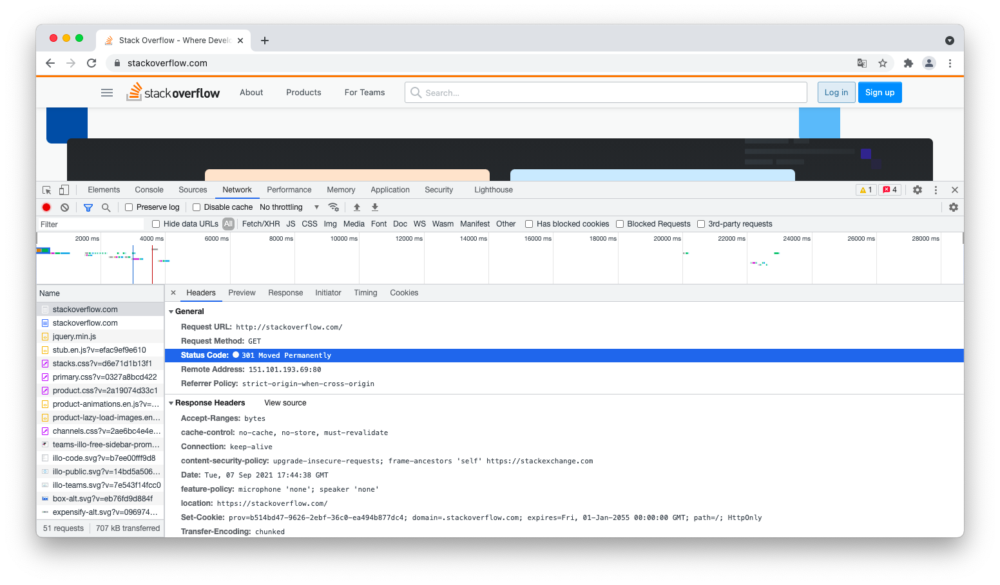
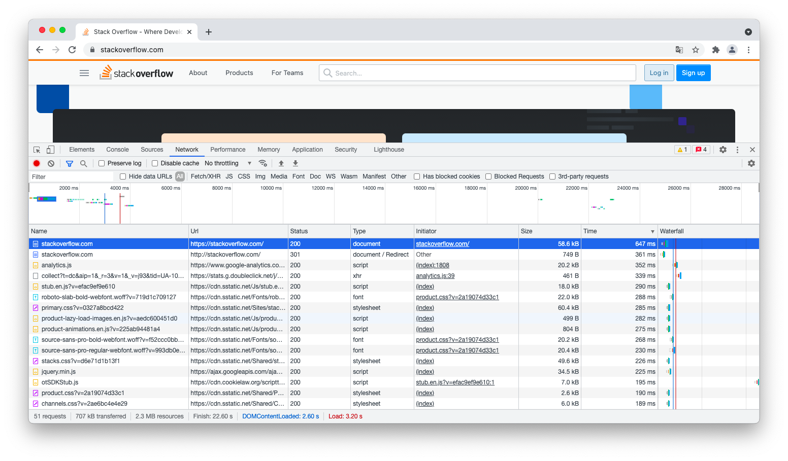
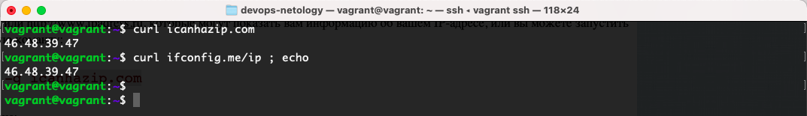
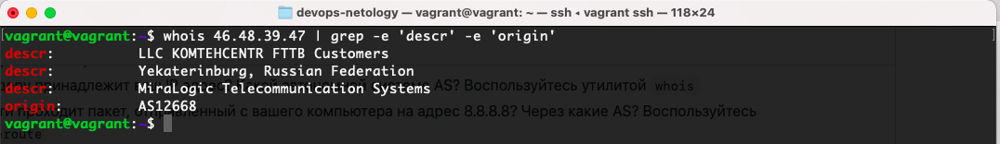
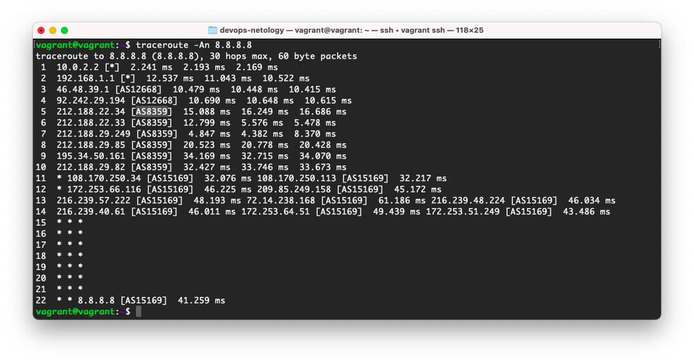
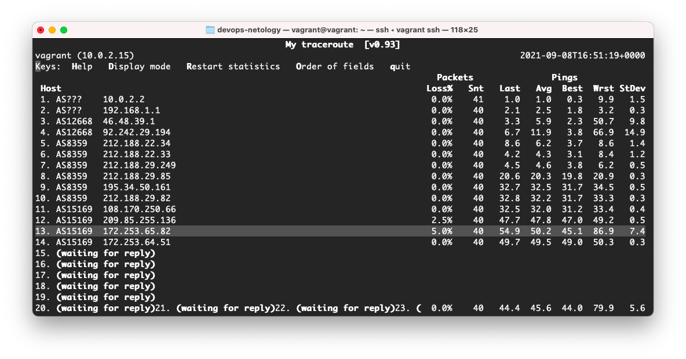

# 3.6. Компьютерные сети, лекция 1
1. Запрос через телнет к сайту `stackoverflow.com` выдал HTTP код 301
    ```bash
   vagrant@vagrant:~$ telnet stackoverflow.com 80
   Trying 151.101.193.69...
   Connected to stackoverflow.com.
   Escape character is '^]'.
   GET /questions HTTP/1.0
   HOST: stackoverflow.com
   
   HTTP/1.1 301 Moved Permanently 
   cache-control: no-cache, no-store, must-revalidate
   location: https://stackoverflow.com/questions
   ...
   ```
   Этот код указывает на то, что запрошенный ресурс был окончательно (на постоянной основе) перемещен в URL указанный в поле `locaton`, т.е. в данном случае, было перенаправление на протокол HTTPS.
   
1. Тоже задание в браузере в консоли разработчика. И видим тот же ответ сервера `Status Code: 301 Moved Permanently`.
   
   Самый долгий запрос был `https://stackoverflow.com/`, обрабатывался `647 ms`
   
   
1. Узнаем свой адрес в интернете через терминал
   
   
1. Мой IP принадлежит `LLC KOMTEHCENTR`. Автономная система `AS12668`.
   
   
1. Мой пакет прошел через сеть `VirtualBox` 10.0.2.2, домашняя локальная сеть 192.168.1.1, сети моего провайдера `AS12668`, сети ПАО МТС (MTS PJSC) `AS8359` и далее пошли сети google `AS15169`.
   
   
1. Используем `mtr`. Самая большая задержка на 13-ом хопе
   ```bash
   13. AS15169  172.253.65.82                                                  5.6%    36   48.6  49.8  45.1  86.9   7.4
   ```
   

1. DNS сервера отвечающие за доменное имя dns.google
   ```bash
   vagrant@vagrant:~$ dig dns.google ns | grep IN
   ;dns.google.			IN	NS
   dns.google.		279	IN	NS	ns3.zdns.google.
   dns.google.		279	IN	NS	ns4.zdns.google.
   dns.google.		279	IN	NS	ns1.zdns.google.
   dns.google.		279	IN	NS	ns2.zdns.google.
   ```   
   Посмотрим их записи `A`
   ```bash
   vagrant@vagrant:~$ dig ns{3,4,1,2}.zdns.google | grep IN
   ;ns3.zdns.google.		IN	A
   ns3.zdns.google.	140	IN	A	216.239.36.114
   ;ns4.zdns.google.		IN	A
   ns4.zdns.google.	265	IN	A	216.239.38.114
   ;ns1.zdns.google.		IN	A
   ns1.zdns.google.	300	IN	A	216.239.32.114
   ;ns2.zdns.google.		IN	A
   ns2.zdns.google.	265	IN	A	216.239.34.114
   ```
   А так же для `dns.google`
   ```bash
   vagrant@vagrant:~$ dig dns.google | grep IN
   ;dns.google.			IN	A
   dns.google.		51	IN	A	8.8.4.4
   dns.google.		51	IN	A	8.8.8.8
   ```
1. Смотрим `PTR`
   ```bash
   vagrant@vagrant:~$ dig -x 216.239.36.114 -x 216.239.32.114 -x 216.239.38.114 -x 216.239.34.114 | grep IN
   ;114.36.239.216.in-addr.arpa.	IN	PTR
   114.36.239.216.in-addr.arpa. 300 IN	PTR	ns3.zdns.google.
   ;114.32.239.216.in-addr.arpa.	IN	PTR
   114.32.239.216.in-addr.arpa. 300 IN	PTR	ns1.zdns.google.
   ;114.38.239.216.in-addr.arpa.	IN	PTR
   114.38.239.216.in-addr.arpa. 300 IN	PTR	ns4.zdns.google.
   ;114.34.239.216.in-addr.arpa.	IN	PTR
   114.34.239.216.in-addr.arpa. 300 IN	PTR	ns2.zdns.google.
   
   vagrant@vagrant:~$ dig -x 8.8.4.4 -x 8.8.8.8 | grep IN
   ;4.4.8.8.in-addr.arpa.		IN	PTR
   4.4.8.8.in-addr.arpa.	291	IN	PTR	dns.google.
   ;8.8.8.8.in-addr.arpa.		IN	PTR
   8.8.8.8.in-addr.arpa.	300	IN	PTR	dns.google.
   ```
   
