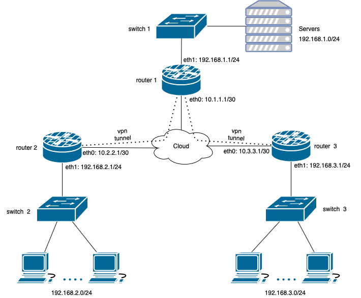

# 3.8. Компьютерные сети, лекция 3
1. Маршрут к публичному IP на `telnet route-views.routeviews.org`  
   ```bash
   route-views>show ip route 46.48.39.47
   Routing entry for 46.48.0.0/17
     Known via "bgp 6447", distance 20, metric 0
     Tag 3267, type external
     Last update from 194.85.40.15 4d21h ago
     Routing Descriptor Blocks:
      194.85.40.15, from 194.85.40.15, 4d21h ago
         Route metric is 0, traffic share count is 1
         AS Hops 2
         Route tag 3267
         MPLS label: none
   ```
   Из вывода видно, что маршрут до моего IP известен через `bgp 6447`.
   Посмотрим таблицу BGP
   ```bash
   route-views>show ip bgp 46.48.39.47   
   BGP routing table entry for 46.48.0.0/17, version 1022400252
   Paths: (24 available, best #8, table default)
     Not advertised to any peer
     Refresh Epoch 1
     3356 12389 12668
       4.68.4.46 from 4.68.4.46 (4.69.184.201)
         Origin IGP, metric 0, localpref 100, valid, external
         Community: 3356:2 3356:22 3356:100 3356:123 3356:501 3356:903 3356:2065 12668:0
         path 7FE168F4AC58 RPKI State not found
         rx pathid: 0, tx pathid: 0
     Refresh Epoch 1
     7018 3257 12389 12668
       12.0.1.63 from 12.0.1.63 (12.0.1.63)
         Origin IGP, localpref 100, valid, external
         Community: 7018:5000 7018:37232
         path 7FE11B078070 RPKI State not found
         rx pathid: 0, tx pathid: 0
     Refresh Epoch 1
     701 1273 12389 12668
       137.39.3.55 from 137.39.3.55 (137.39.3.55)
         Origin IGP, localpref 100, valid, external
         path 7FE0C468EEF0 RPKI State not found
         rx pathid: 0, tx pathid: 0
    --More-- 
   ```
   Доступно 24 маршрута, лучший 8-ой
   ```bash
   route-views>show ip bgp 46.48.39.47 bestpath 
   BGP routing table entry for 46.48.0.0/17, version 1022400252
   Paths: (24 available, best #8, table default)
     Not advertised to any peer
     Refresh Epoch 1
     3267 12668
       194.85.40.15 from 194.85.40.15 (185.141.126.1)
         Origin IGP, metric 0, localpref 100, valid, external, best
         path 7FE03307CE30 RPKI State not found
         rx pathid: 0, tx pathid: 0x0
   route-views>
   ```
   Проходит через `AS3267` и `AS12668`, также его видно из первого вывода `show ip route`  
2. Создаем `dummy` интерфейс. Сначала включим модуль.
   ```bash
   vagrant@vagrant:~$ sudo modprobe dummy
   vagrant@vagrant:~$ lsmod | grep dummy
   dummy                  16384  0
   ```
   Для того чтобы добавленный модуль сохранился после перезагрузки, можно добавить его в `/etc/modules`
   ```bash
   echo "dummy" >> /etc/modules
   ```
   Добавляем сам интерфейс и назначаем ему ip адрес
   ```bash
   vagrant@vagrant:~$ sudo ip link add dummy0 type dummy
   vagrant@vagrant:~$ sudo ip link set dummy0 up
   vagrant@vagrant:~$ sudo ip addr add 10.1.1.1/32 dev dummy0   
   vagrant@vagrant:~$ ip -br addr show dummy0 
   dummy0           UNKNOWN        10.1.1.1/32 fe80::8b:6bff:fe66:ffcf/64
   ```
   тут аналогично, чтобы интерфейс сохранился после перезагрузки нужно прописать его например в `/etc/network/interfaces`  
   <br>
   Добавим несколько статических маршрутов
   ```bash
   vagrant@vagrant:~$ sudo ip route add 192.168.100.0/24 via 10.0.2.2
   vagrant@vagrant:~$ sudo ip route add 192.168.200.0/24 dev eth0
   vagrant@vagrant:~$ sudo ip route add 192.168.200.0/24 dev dummy0 metric 100
   ```
   Посмотрим что получилось
   ```bash
   vagrant@vagrant:~$ ip route 
   default via 10.0.2.2 dev eth0 proto dhcp src 10.0.2.15 metric 100 
   10.0.2.0/24 dev eth0 proto kernel scope link src 10.0.2.15 
   10.0.2.2 dev eth0 proto dhcp scope link src 10.0.2.15 metric 100 
   192.168.100.0/24 via 10.0.2.2 dev eth0 
   192.168.200.0/24 dev eth0 scope link 
   192.168.200.0/24 dev dummy0 scope link metric 100 
   
   vagrant@vagrant:~$ ip route get 192.168.100.1
   192.168.100.1 via 10.0.2.2 dev eth0 src 10.0.2.15 uid 1000 
       cache 
   vagrant@vagrant:~$ ip route get 192.168.200.1
   192.168.200.1 dev eth0 src 10.0.2.15 uid 1000 
       cache 
   ```
   
3. Смотрим все открытые TCP порты
   ```bash
   vagrant@vagrant:~$ ss -ta
   State        Recv-Q       Send-Q             Local Address:Port                Peer Address:Port        Process       
   LISTEN       0            4096                     0.0.0.0:sunrpc                   0.0.0.0:*                         
   LISTEN       0            4096               127.0.0.53%lo:domain                   0.0.0.0:*                         
   LISTEN       0            128                      0.0.0.0:ssh                      0.0.0.0:*                         
   ESTAB        0            0                      10.0.2.15:ssh                     10.0.2.2:62382                     
   LISTEN       0            4096                        [::]:sunrpc                      [::]:*                         
   LISTEN       0            128                         [::]:ssh                         [::]:*  
   ```
   Если нужно порты в цифрах
   ```bash
   vagrant@vagrant:~$ ss -tan
   State        Recv-Q       Send-Q              Local Address:Port               Peer Address:Port        Process       
   LISTEN       0            4096                      0.0.0.0:111                     0.0.0.0:*                         
   LISTEN       0            4096                127.0.0.53%lo:53                      0.0.0.0:*                         
   LISTEN       0            128                       0.0.0.0:22                      0.0.0.0:*                         
   ESTAB        0            0                       10.0.2.15:22                     10.0.2.2:62382                     
   LISTEN       0            4096                         [::]:111                        [::]:*                         
   LISTEN       0            128                          [::]:22                         [::]:* 
   ```
   Из вывода видно, что слушается пара SSH на порту 22 и один установлен с адреса `10.0.2.2:62382` на адрес `10.0.2.15:22`. Так же видим порт 53, это DNS, и служебный порт 111 `sunrpc` (SUN Remote Procedure Call) используется NFS, NIS или любыми другими rpc-based сервисами.  
   <br>
4. Смотрим UDP
   ```bash
   vagrant@vagrant:~$ ss -ua
   State        Recv-Q       Send-Q              Local Address:Port                Peer Address:Port       Process       
   UNCONN       0            0                   127.0.0.53%lo:domain                   0.0.0.0:*                        
   UNCONN       0            0                  10.0.2.15%eth0:bootpc                   0.0.0.0:*                        
   UNCONN       0            0                         0.0.0.0:sunrpc                   0.0.0.0:*                        
   UNCONN       0            0                            [::]:sunrpc                      [::]:*                        
   vagrant@vagrant:~$ ss -uan
   State        Recv-Q       Send-Q               Local Address:Port               Peer Address:Port       Process       
   UNCONN       0            0                    127.0.0.53%lo:53                      0.0.0.0:*                        
   UNCONN       0            0                   10.0.2.15%eth0:68                      0.0.0.0:*                        
   UNCONN       0            0                          0.0.0.0:111                     0.0.0.0:*                        
   UNCONN       0            0                             [::]:111                        [::]:*
   ```
   Здесь видим теже порты 111 `sunrpc` и 53 `dns`, а так же порт 68 `bootpc` (Bootstrap Protocol Client) используется DHCP для получения динамического адреса.  
   <br>
5. L3 диаргамма  <br><br>
   