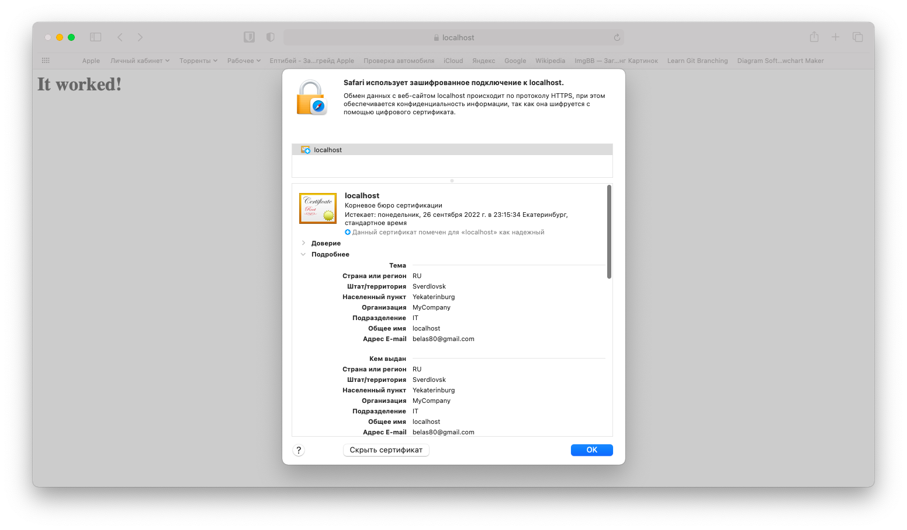
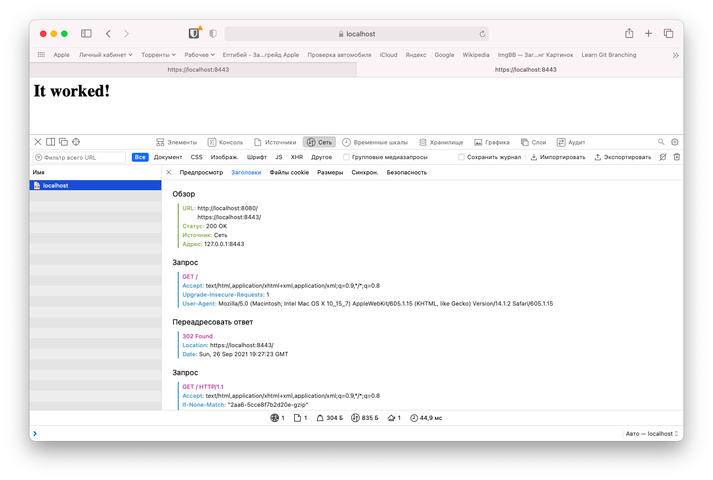
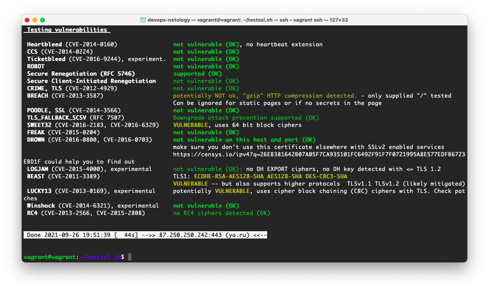
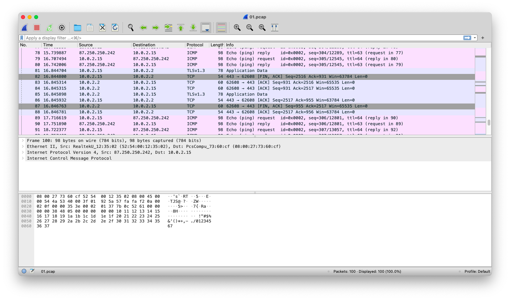

# 3.9. Элементы безопасности информационных систем  
1. Установка Apache2
   ```bash
   vagrant@vagrant:~$ sudo apt install apache2
   vagrant@vagrant:~$ systemctl status apache2
    ● apache2.service - The Apache HTTP Server
         Loaded: loaded (/lib/systemd/system/apache2.service; enabled; vendor preset: enabled)
         Active: active (running) since Sun 2021-09-26 17:04:06 UTC; 1min 1s ago
           Docs: https://httpd.apache.org/docs/2.4/
       Main PID: 3001 (apache2)
          Tasks: 55 (limit: 1112)
         Memory: 5.6M
         CGroup: /system.slice/apache2.service
                 ├─3001 /usr/sbin/apache2 -k start
                 ├─3002 /usr/sbin/apache2 -k start
                 └─3003 /usr/sbin/apache2 -k start
    
    Sep 26 17:04:06 vagrant systemd[1]: Starting The Apache HTTP Server...
    Sep 26 17:04:06 vagrant systemd[1]: Started The Apache HTTP Server.
   ```
   Включим модуль SSL
   ```bash
   vagrant@vagrant:~$ a2query -m | grep ssl
   vagrant@vagrant:~$ 
   vagrant@vagrant:~$ sudo a2enmod ssl 
   Considering dependency setenvif for ssl:
   Module setenvif already enabled
   Considering dependency mime for ssl:
   Module mime already enabled
   Considering dependency socache_shmcb for ssl:
   Enabling module socache_shmcb.
   Enabling module ssl.
   See /usr/share/doc/apache2/README.Debian.gz on how to configure SSL and create self-signed certificates.
   To activate the new configuration, you need to run:
     systemctl restart apache2
   
   vagrant@vagrant:~$ sudo systemctl restart apache2
   vagrant@vagrant:~$ a2query -m | grep ssl
   ssl (enabled by site administrator)
   ```
   Сгенерируем самоподписанный сертификат состоящий из закрытого ключа `my-selfsigned.key` и сертификата `my-selfsigned.crt`
   ```bash
   vagrant@vagrant:~$ sudo openssl req -x509 -nodes -days 365 -newkey rsa:2048 -keyout /etc/ssl/private/my-selfsigned.key -out /etc/ssl/certs/my-selfsigned.crt
   Generating a RSA private key
   .+++++
   ........+++++
   writing new private key to '/etc/ssl/private/my-selfsigned.key'
   -----
   You are about to be asked to enter information that will be incorporated
   into your certificate request.
   What you are about to enter is what is called a Distinguished Name or a DN.
   There are quite a few fields but you can leave some blank
   For some fields there will be a default value,
   If you enter '.', the field will be left blank.
   -----
   Country Name (2 letter code) [AU]:RU
   State or Province Name (full name) [Some-State]:Sverdlovskaya
   Locality Name (eg, city) []:Yekaterinburg
   Organization Name (eg, company) [Internet Widgits Pty Ltd]:MyCompany
   Organizational Unit Name (eg, section) []:IT
   Common Name (e.g. server FQDN or YOUR name) []:localhost
   Email Address []:belas80@gmail.com
   vagrant@vagrant:~$ 
   ```
   Создадим файл конфигурации нашего тестового сайта в папке `sites-available` следующего содержания
   ```bash
   vagrant@vagrant:~$ cat /etc/apache2/sites-available/my-site.conf 
   <VirtualHost *:443>
      ServerName localhost
      DocumentRoot /var/www/my-site
      SSLEngine on
      SSLCertificateFile /etc/ssl/certs/my-selfsigned.crt
      SSLCertificateKeyFile /etc/ssl/private/my-selfsigned.key
   </VirtualHost>
   ```
   Создадим директорию нашего тестового сайта и его страницу
   ```bash
   vagrant@vagrant:~$ sudo mkdir /var/www/my-site
   vagrant@vagrant:~$ sudo tee /var/www/my-site/index.html
   <h1>It worked!</h1>
   <h1>It worked!</h1>
   vagrant@vagrant:~$ cat /var/www/my-site/index.html 
   <h1>It worked!</h1>
   ```
   Включим наш новый сайт, протестируем и перезагрузим конфиг
   ```bash
   vagrant@vagrant:~$ sudo a2ensite my-site.conf 
   Enabling site my-site.
   To activate the new configuration, you need to run:
     systemctl reload apache2
   vagrant@vagrant:~$ sudo apache2ctl configtest 
   Syntax OK
   vagrant@vagrant:~$ sudo systemctl reload apache2.service 
   vagrant@vagrant:~$ 
   ```
   Наш сайт готов, осталось протестировать с клиента. Для этого пробросим порт в vagrant и зайдем на него через браузер
   ```bash
   config.vm.network "forwarded_port", guest: 443, host: 8443
   ```
   
   Дополнительно сделаем редирект с 80 порта на 443, добавив в конфиг сайта `/etc/apache2/sites-available/my-site.conf` следующие строчки
   ```bash
   <VirtualHost *:80>
     ServerName localhost
     Redirect / https://localhost:8443/
   </VirtualHost>
   ```
   
2. Проверим на TLS уязвимости произвольный сайт в интернете с помощью `testssl.sh`
   ```bash
      vagrant@vagrant:~/testssl.sh$ ./testssl.sh -U --sneaky https://ya.ru      
   ```
   
   Утилита показала 4 уязвимости.
3. Установим ssh сервер на VM2, если он не стоит командой `apt install openssh-server`.  
   Попробуем подключиться на VM2
   ```bash
   vagrant@vagrant:~$ ssh vagrant@172.28.128.3
   vagrant@172.28.128.3's password:
   ```
   Запрашивает пароль.
   Сгенерируем на VM1 новый приватный ключ и скопируем его публичный ключ на VM2
   ```bash
   vagrant@vagrant:~$ ssh-keygen 
   Generating public/private rsa key pair.
   Enter file in which to save the key (/home/vagrant/.ssh/id_rsa): 
   Enter passphrase (empty for no passphrase): 
   Enter same passphrase again: 
   Your identification has been saved in /home/vagrant/.ssh/id_rsa
   Your public key has been saved in /home/vagrant/.ssh/id_rsa.pub
   The key fingerprint is:
   SHA256:fGp3xQBPBZ7cAB9ROCj1dGeh5Yz3og5JGEwckEp4G/s vagrant@vagrant
   The key's randomart image is:
   +---[RSA 3072]----+
   |   .  .+oo+oB*+o+|
   |  . + .oo .Xo**o |
   |   o =  o.  O+.+ |
   |    +  . o   o. .|
   |     .  S o   + .|
   |      E  + . o . |
   |        o + o    |
   |       . . +     |
   |            .    |
   +----[SHA256]-----+
   
   vagrant@vagrant:~$ ll .ssh/id*
   -rw------- 1 vagrant vagrant 2602 Sep 27 17:09 .ssh/id_rsa
   -rw-r--r-- 1 vagrant vagrant  569 Sep 27 17:09 .ssh/id_rsa.pub
   
   vagrant@vagrant:~$ ssh-copy-id vagrant@172.28.128.3
   /usr/bin/ssh-copy-id: INFO: Source of key(s) to be installed: "/home/vagrant/.ssh/id_rsa.pub"
   /usr/bin/ssh-copy-id: INFO: attempting to log in with the new key(s), to filter out any that are already installed
   /usr/bin/ssh-copy-id: INFO: 1 key(s) remain to be installed -- if you are prompted now it is to install the new keys
   vagrant@172.28.128.3's password: 
   
   Number of key(s) added: 1
   
   Now try logging into the machine, with:   "ssh 'vagrant@172.28.128.3'"
   and check to make sure that only the key(s) you wanted were added.
   ```
   Пробуем подключится с ключом на VM2
   ```bash
   vagrant@vagrant:~$ ssh vagrant@172.28.128.3
   Welcome to Ubuntu 20.04.2 LTS (GNU/Linux 5.4.0-80-generic x86_64)

   * Documentation:  https://help.ubuntu.com
   * Management:     https://landscape.canonical.com
   * Support:        https://ubuntu.com/advantage

     System information as of Mon 27 Sep 2021 05:17:43 PM UTC

     System load:  0.0               Processes:             111
     Usage of /:   2.9% of 61.31GB   Users logged in:       1
     Memory usage: 17%               IPv4 address for eth0: 10.0.2.15
     Swap usage:   0%                IPv4 address for eth1: 172.28.128.3


   This system is built by the Bento project by Chef Software
   More information can be found at https://github.com/chef/bento
   Last login: Mon Sep 27 17:03:01 2021 from 172.28.128.4
   vagrant@vagrant:~$ tty
   /dev/pts/1
   vagrant@vagrant:~$ who
   vagrant  pts/0        2021-09-27 16:56 (10.0.2.2)
   vagrant  pts/1        2021-09-27 17:17 (172.28.128.4)
   ```
   Пустил без запроса пароля, т.е. подхватил и пустил с созданным ключом.
4. Переименуем файлы ключей
   ```bash
   vagrant@vagrant:~$ mv .ssh/id_rsa .ssh/my_private_rsa
   vagrant@vagrant:~$ mv .ssh/id_rsa.pub .ssh/my_public_rsa.pub
   ```
   Создадим конфиг клиента
   ```bash
   vagrant@vagrant:~$ cat .ssh/config 
   Host srv2
     HostName 172.28.128.3
     IdentityFile ~/.ssh/my_private_rsa
     User vagrant
   ```
   И попробуем подключится по имени сервера
   ```bash
   vagrant@vagrant:~$ ssh srv2
   Welcome to Ubuntu 20.04.2 LTS (GNU/Linux 5.4.0-80-generic x86_64)
   
    * Documentation:  https://help.ubuntu.com
    * Management:     https://landscape.canonical.com
    * Support:        https://ubuntu.com/advantage

     System information as of Mon 27 Sep 2021 05:35:37 PM UTC
   
     System load:  0.08              Processes:             111
     Usage of /:   2.9% of 61.31GB   Users logged in:       1
     Memory usage: 17%               IPv4 address for eth0: 10.0.2.15
     Swap usage:   0%                IPv4 address for eth1: 172.28.128.3
   
   
   This system is built by the Bento project by Chef Software
   More information can be found at https://github.com/chef/bento
   Last login: Mon Sep 27 17:28:54 2021 from 172.28.128.4
   ```
5. Соберем дамп трафика утилитой `tcpdump` в формате `pcap`, 100 пакетов.
   ```bash
   vagrant@vagrant:~$ sudo tcpdump -c 100 -w 01.pcap -i eth0
   tcpdump: listening on eth0, link-type EN10MB (Ethernet), capture size 262144 bytes
   100 packets captured
   100 packets received by filter
   0 packets dropped by kernel
   
   vagrant@vagrant:~$ ll -h 01.pcap 
   -rw-r--r-- 1 tcpdump tcpdump 16K Sep 27 18:24 01.pcap
   ```
   Откроем этот файл в Wireshark
   
6. Сканируем хост scanme.nmap.org
   ```bash
   vagrant@vagrant:~$ nmap scanme.nmap.org
   Starting Nmap 7.80 ( https://nmap.org ) at 2021-09-29 16:00 UTC
   Nmap scan report for scanme.nmap.org (45.33.32.156)
   Host is up (0.21s latency).
   Other addresses for scanme.nmap.org (not scanned): 2600:3c01::f03c:91ff:fe18:bb2f
   Not shown: 996 closed ports
   PORT      STATE SERVICE
   22/tcp    open  ssh
   80/tcp    open  http
   9929/tcp  open  nping-echo
   31337/tcp open  Elite
   
   Nmap done: 1 IP address (1 host up) scanned in 3.48 seconds
   ```
   Здесь открыты сервисы ssh порт 22, http порт 80, nping-echo порт 9929 и Elite порт 31337.
7. Установим фаервол на сервер из задания 3 (`apt install ufw`) и откроем порты 22,80,443
   ```bash
   vagrant@vagrant:~$ sudo ufw status
   Status: inactive
   vagrant@vagrant:~$ sudo ufw allow "Apache Full"
   Rules updated
   Rules updated (v6)
   vagrant@vagrant:~$ sudo ufw allow OpenSSH
   Rules updated
   Rules updated (v6)
   vagrant@vagrant:~$ sudo ufw enable
   Command may disrupt existing ssh connections. Proceed with operation (y|n)? y
   Firewall is active and enabled on system startup
   vagrant@vagrant:~$ sudo ufw status verbose 
   Status: active
   Logging: on (low)
   Default: deny (incoming), allow (outgoing), disabled (routed)
   New profiles: skip
   
   To                         Action      From
   --                         ------      ----
   80,443/tcp (Apache Full)   ALLOW IN    Anywhere                  
   22/tcp (OpenSSH)           ALLOW IN    Anywhere                  
   80,443/tcp (Apache Full (v6)) ALLOW IN    Anywhere (v6)             
   22/tcp (OpenSSH (v6))      ALLOW IN    Anywhere (v6)    
   ```
   Порты отрыты. По умолчанию добавляются правила для IPv4 и для IPv6. Это поведение можно изменить установив `IPV6=no` в `/etc/default/ufw`.