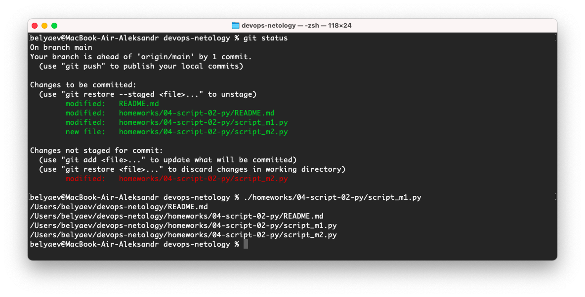
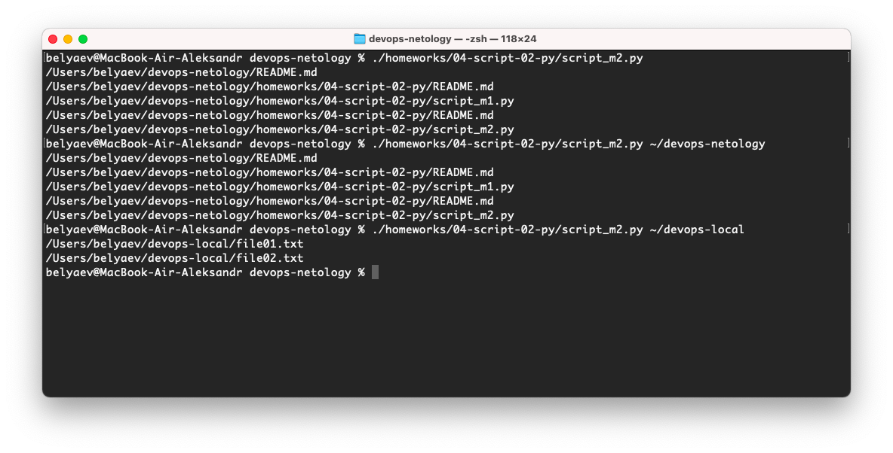
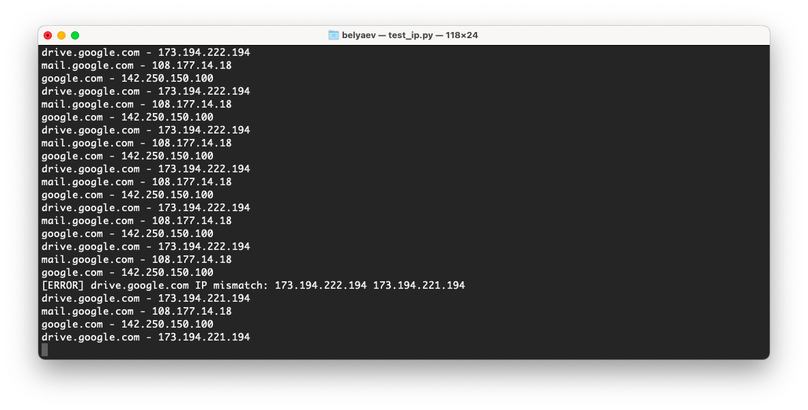

# 4.2. Использование Python для решения типовых DevOps задач  
1. Скрипт ниже не присвоит переменной `с` значение, результатом будет ошибка, потому что мы пытаемся сложить два разных типа переменных, целочисленное (int) и строку (str).  
    ```python
    >>> a = 1
    >>> b = '2'
    >>> c = a + b
    Traceback (most recent call last):
      File "<stdin>", line 1, in <module>
    TypeError: unsupported operand type(s) for +: 'int' and 'str'
    >>> 
    ```
    Для того чтобы получить значение 12, нужно преобразовать числовую переменную `а` в строковую  
    ```python
    >>> c = str(a) + b
    >>> print(c)
    12
    >>> 
    ```
    Чтобы получить значение 3, нужно преобразовать переменную `b` в число  
    ```python
    >>> c = a + int(b)
    >>> print(c)
    3
    >>> 
    ```
2. Можно определить полный путь к указанной директории с помощью команды `pwd` и склеить его с результатом в `prepare_result`. А чтобы скрипт показывал все измененные файлы уберем `break`  
   ```python
   #!/usr/bin/env python3
   
   import os
   
   bash_command = ["cd ~/devops-netology", "git status"]
   fullPath = os.popen(bash_command[0]+' && pwd').read()    # определим полный путь к директории
   result_os = os.popen(' && '.join(bash_command)).read()
   #is_change = False  # это нам тоже не понадобится
   for result in result_os.split('\n'):
       if result.find('modified') != -1:
           prepare_result = '/'.join([fullPath.replace('\n',''), result.replace('\tmodified:   ', '')])    # склеиваем полный путь
           print(prepare_result)
           #break    # убираем чтобы скрипт показывал все найденные modified
   ```
   Проверим работу скрипта  
   
3. Доработаем скрипт так, чтобы он воспринимал путь к репозиторию как входной параметр. Заодно упростим его пользуясь методами модуля `os` и сделаем проверку был ли указан путь.  
   ```python
   #!/usr/bin/env python3
   
   import os
   import sys  # добавим модуль sys чтобы принимать параметры
   
   if len(sys.argv) > 1:       # если кол-во входных данных больше одного то
       myDir = sys.argv[1]     # путь будет указанный в параметре
   else:
       myDir = '.'             # иначе, будем использовать текущую директорию
   
   os.chdir(myDir)             # меняем рабочую директорию
   
   result_os = os.popen("git status").read()   # убрал все лишнее, "git status" будет достаточно
   for result in result_os.split('\n'):
       if result.find('modified') != -1:
           prepare_result = os.path.abspath(result.replace('\tmodified:   ', ''))  # ну и добавляем полный путь
           print (prepare_result)
   ```
   Результат
   
4. Скрипт, который опрашивает веб-сервисы, получает их IP, выводит информацию в стандартный вывод и проверяет текущий IP сервиса c его IP из предыдущей проверки.  
   ```python
   #!/usr/bin/env python3
   import socket
   import time
   
   test_services = {'drive.google.com':'','mail.google.com':'','google.com':''}
   while 1==1:
       for srv, old_ip in test_services.items():
           current_ip = socket.gethostbyname(srv)
           if old_ip == '':
               test_services[srv] = current_ip
           elif old_ip != current_ip:
               print (' '.join(['[ERROR]',srv,'IP mismatch:',old_ip,current_ip]))
               test_services[srv] = current_ip
           print (' - '.join([srv, current_ip]))
           time.sleep(1)
   ```
   Результат
   