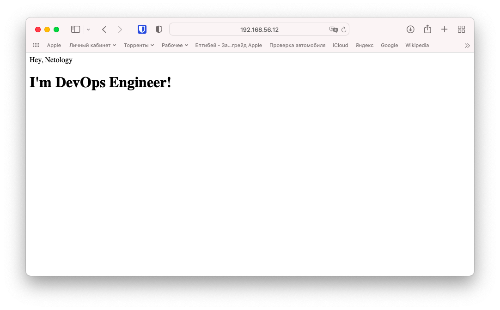

# 5.3. Введение. Экосистема. Архитектура. Жизненный цикл Docker контейнера  

## Задача 1

   Для реализации этой задачи заранее подготовил html файл с содержимым из задания и скопировал его в свой новый образ
   при билде. За основу взял официальный nginx образ. Докерфайл получился следующего содержания  
   ```bash
   vagrant@server2:~/nginx$ cat Dockerfile 
   FROM nginx
   
   COPY index.html /usr/share/nginx/html/
   vagrant@server2:~/nginx$ 
   ```
   Далее забилдил его  
   ```bash
   vagrant@server2:~/nginx$ docker build -t belas80/nginx .
   Sending build context to Docker daemon  3.072kB
   Step 1/2 : FROM nginx
    ---> 87a94228f133
   Step 2/2 : COPY index.html /usr/share/nginx/html/
    ---> d0e3cbddaff0
   Successfully built d0e3cbddaff0
   Successfully tagged belas80/nginx:latest
   
   vagrant@server2:~/nginx$ docker images
   REPOSITORY      TAG       IMAGE ID       CREATED             SIZE
   belas80/nginx   latest    d0e3cbddaff0   About an hour ago   133MB
   nginx           latest    87a94228f133   3 weeks ago         133MB
   vagrant@server2:~/nginx$ 
   ```
   Проверил что все работает запустив его командой `docker run -dp 8080:80 belas80/nginx`  
   
   И запушил образ в hub.docker.com командой `docker push belas80/nginx`  
   Мой ответ в виде ссылки [https://hub.docker.com/r/belas80/nginx](https://hub.docker.com/r/belas80/nginx)  
   
## Задача 2  

   В подобном сценарии думаю возможны разные варианты. Все зависит от нагрузки. Для высоконагруженного монолитного java 
   веб-приложения, мне кажется больше подойдет физическая машина. Все остальное в принципе хорошо запустится в Docker 
   контейнерах.  
   
## Задача 3  

   ```bash
   # проверяем на хосте что папка пуста
   vagrant@server2:~$ ls data/
   
   # запускаем centos подключая папку data
   vagrant@server2:~$ docker run -di -v $(pwd)/data:/data centos
   f37db5623e26686119a305af4cbb404f9dd9189c295c9e37df44360632a08cbb
   
   # тоже самое для debian
   vagrant@server2:~$ docker run -di -v $(pwd)/data:/data debian
   408ebf944bd61259c7c2101dd26867709609ffcfd7323f29d507c9242992ecf5
   
   # смотрим что оба контейнера запущены
   vagrant@server2:~$ docker ps
   CONTAINER ID   IMAGE     COMMAND       CREATED              STATUS              PORTS     NAMES
   408ebf944bd6   debian    "bash"        56 seconds ago       Up 55 seconds                 dreamy_haibt
   f37db5623e26   centos    "/bin/bash"   About a minute ago   Up About a minute             stoic_nash
   
   # подключаемся к первому, т.е. к centos и создаем пустой файл в папке /data
   vagrant@server2:~$ docker exec -it f37db5623e26 bash
   [root@f37db5623e26 /]# touch /data/centos_file
   [root@f37db5623e26 /]# ls /data/
   centos_file
   [root@f37db5623e26 /]# exit
   exit
   
   # cоздаем файл на хостовой машине
   vagrant@server2:~$ touch data/server2_file
   vagrant@server2:~$ ls data/
   centos_file  server2_file
   
   # проверяем что находится в папке /data второго контейнера debian
   vagrant@server2:~$ docker exec 408ebf944bd6 ls /data
   centos_file
   server2_file
   vagrant@server2:~$
   ```

## Задача 4

   ```bash
   # Собираем образ из Dockerfile с Alpine и Ansible
   vagrant@server2:~/ansible$ docker build -t belas80/ansible:2.9.24 .
   # ... много много строк вывода
    ---> 573cdf366451
   Step 3/5 : RUN mkdir /ansible &&     mkdir -p /etc/ansible &&     echo 'localhost' > /etc/ansible/hosts
    ---> Running in 3c7c0b504e50
   Removing intermediate container 3c7c0b504e50
    ---> 1b49bac03f27
   Step 4/5 : WORKDIR /ansible
    ---> Running in 0a1705a88377
   Removing intermediate container 0a1705a88377
    ---> 240f630e256f
   Step 5/5 : CMD [ "ansible-playbook", "--version" ]
    ---> Running in 3df1206409c8
   Removing intermediate container 3df1206409c8
    ---> 7b749662b9de
   Successfully built 7b749662b9de
   Successfully tagged belas80/ansible:2.9.24
   vagrant@server2:~/ansible$ 
   
   # Проверим, запустив контейнер из этого образа, выводом будет версия ansible
   vagrant@server2:~/ansible$ docker run --rm belas80/ansible:2.9.24
   ansible-playbook 2.9.24
     config file = None
     configured module search path = ['/root/.ansible/plugins/modules', '/usr/share/ansible/plugins/modules']
     ansible python module location = /usr/lib/python3.9/site-packages/ansible
     executable location = /usr/bin/ansible-playbook
     python version = 3.9.5 (default, May 12 2021, 20:44:22) [GCC 10.3.1 20210424]
   vagrant@server2:~/ansible$ 
   
   # Залогинимся и запушим этот образ на hub.docker.com
   vagrant@server2:~/ansible$ docker login -u belas80
   Password: 
   WARNING! Your password will be stored unencrypted in /home/vagrant/.docker/config.json.
   Configure a credential helper to remove this warning. See
   https://docs.docker.com/engine/reference/commandline/login/#credentials-store
   
   Login Succeeded
   
   vagrant@server2:~/ansible$ docker push belas80/ansible:2.9.24
   The push refers to repository [docker.io/belas80/ansible]
   99b6d9f8f7b2: Pushed 
   fac945173c56: Pushed 
   e2eb06d8af82: Mounted from library/alpine 
   2.9.24: digest: sha256:a1648107b4b50875098bee4f2efeb0399776f165214e15dd96de18e42f152310 size: 947
   vagrant@server2:~/ansible$ 
   ```

   [Cсылка на Docker образ на Docker Hub](https://hub.docker.com/r/belas80/ansible/tags)