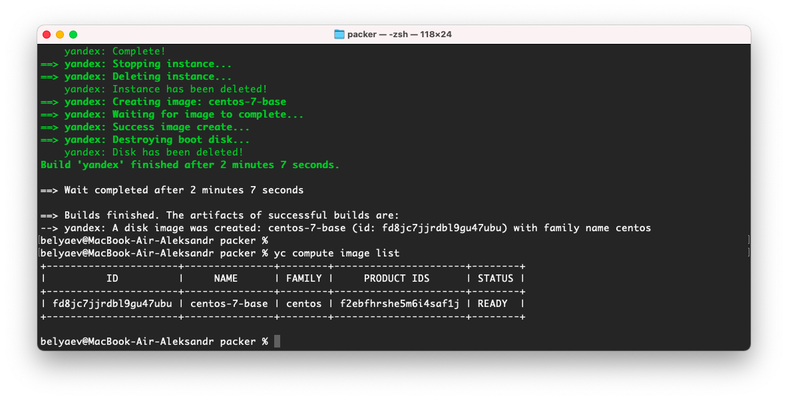
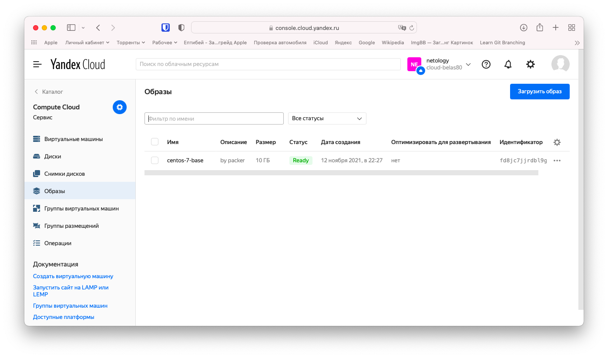
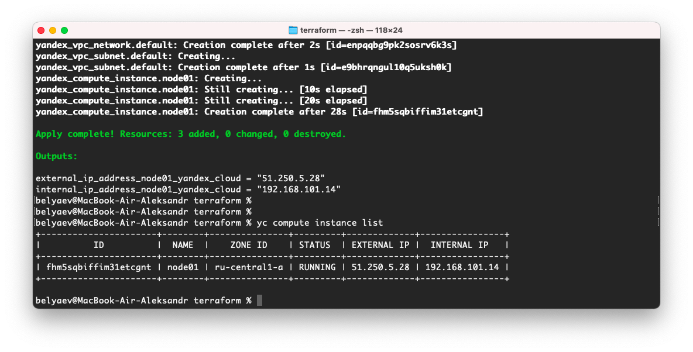
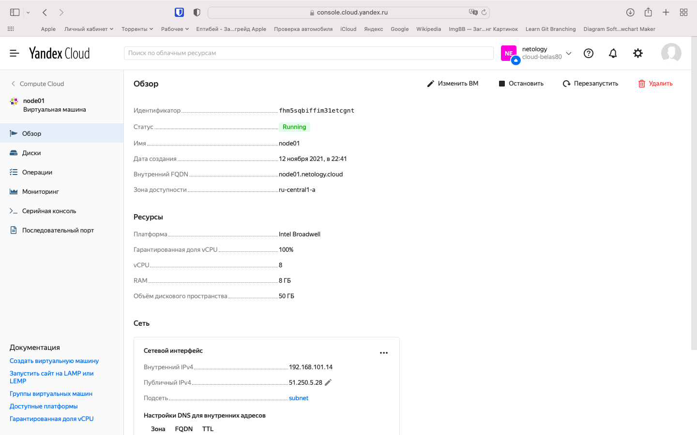
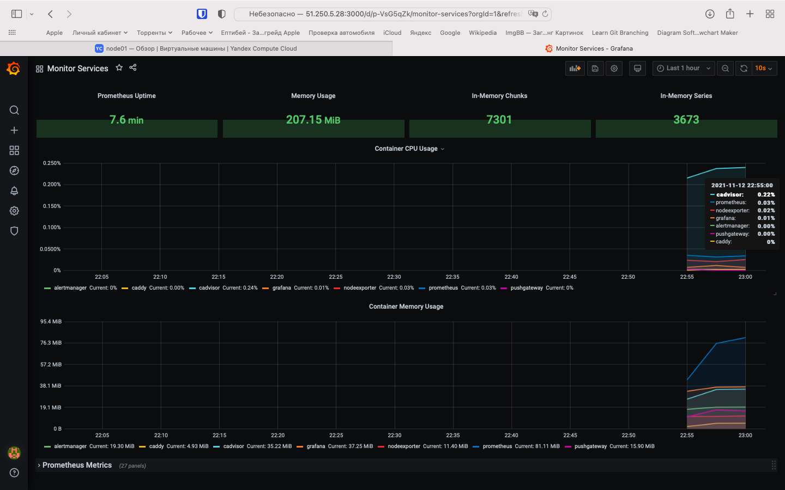
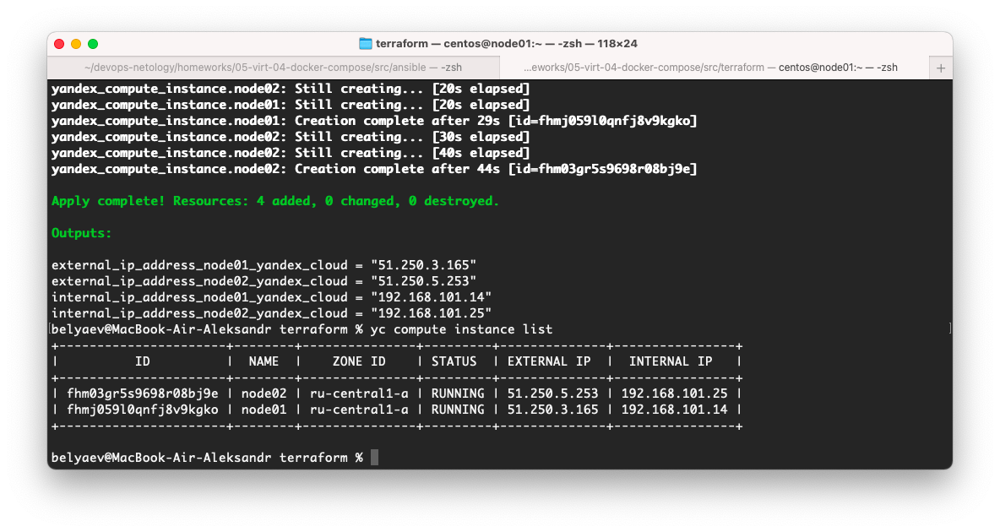
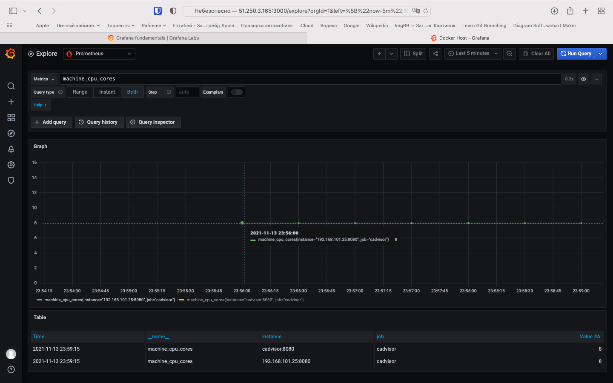
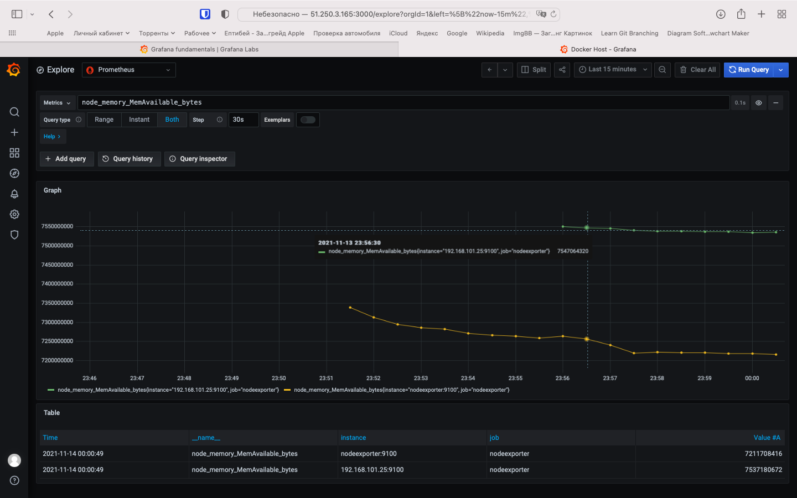
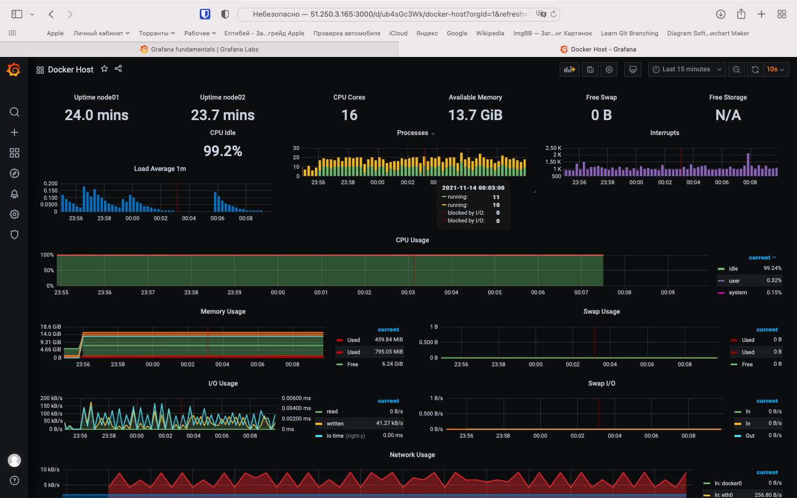

# 5.4. Оркестрация группой Docker контейнеров на примере Docker Compose  

##  Задача 1  

   Образ операционной системы с помощью Packer.  
   
     
   
## Задача 2  

   Первая виртуальная машина в Яндекс.Облаке.  
   
     
   
## Задача 3  

   Веб-интерфейса Grafana с текущими метриками.  

     
   
## Задача 4  

   Новый деплой хостов, новые IP
     

   ЦПУ второй ноды

   

   Свободная память второй ноды  
   
     
   
   Общий дашбоард с uptime первой и второй ноды, а так же общее количество cpu и доступной памяти двух нод.  
   
     