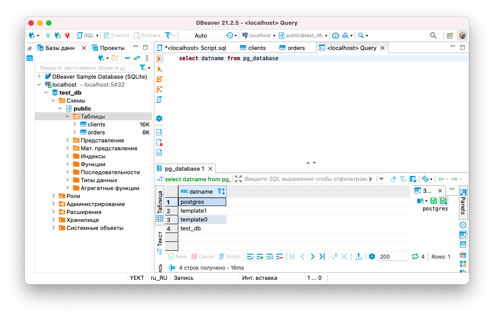
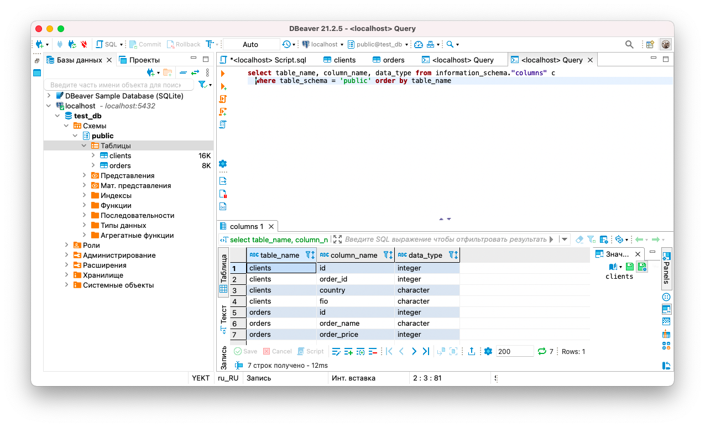
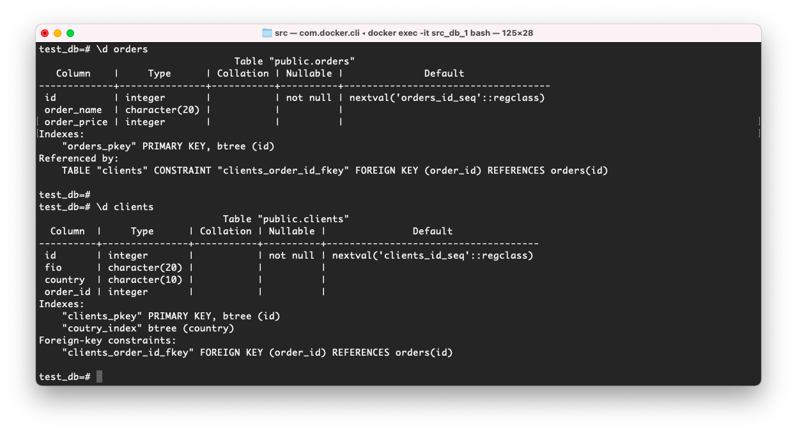
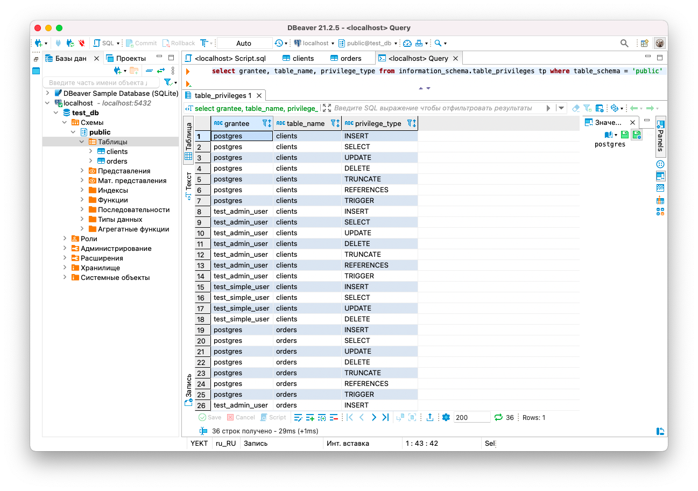
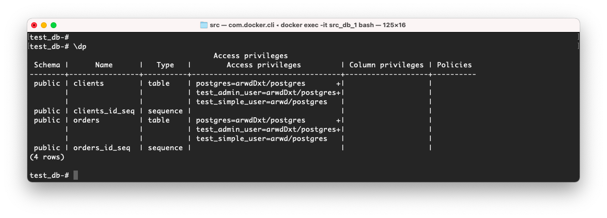
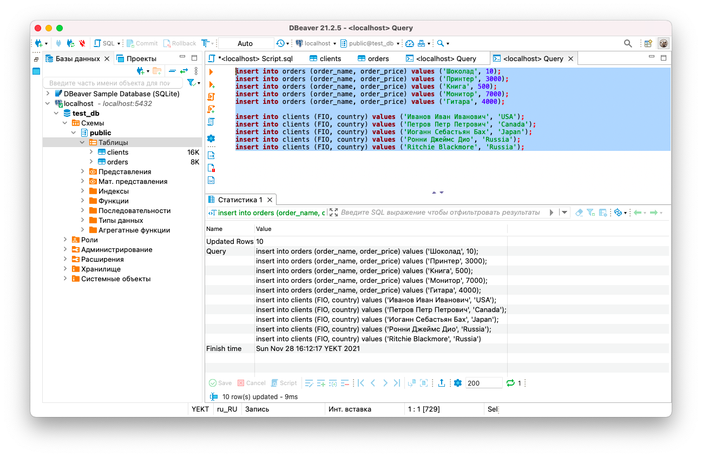

# 6.2. SQL  

## Задача 1

   PostgreSQL (версия 12) c 2 volume  
   Содержимое `docker-compose.yml`:  
   ```yaml
   version: '3.1'
   
   services:
   
     db:
       image: postgres:12
       restart: always
       environment:
         POSTGRES_PASSWORD: example
       ports:
         - 5432:5432
       volumes:
         - pgdata:/var/lib/postgresql/data
         - pgbackup:/pgbackup
   
   volumes:
     pgdata:
     pgbackup:
   ```
   Результат:  
   ```bash
   belyaev@MacBook-Air-Aleksandr src % docker-compose up -d
   Creating network "src_default" with the default driver
   Creating src_db_1 ... done
   belyaev@MacBook-Air-Aleksandr src % 
   belyaev@MacBook-Air-Aleksandr src % docker-compose exec db postgres --version         
   postgres (PostgreSQL) 12.9 (Debian 12.9-1.pgdg110+1)
   belyaev@MacBook-Air-Aleksandr src % 
   belyaev@MacBook-Air-Aleksandr src % docker-compose ps
   Name                Command              State           Ports         
   -------------------------------------------------------------------------
   src_db_1   docker-entrypoint.sh postgres   Up      0.0.0.0:5432->5432/tcp
   belyaev@MacBook-Air-Aleksandr src % 
   ```

## Задача 2  

   Создаем новую БД, таблицы, пользователей и назначаем им права.  
   * Создание пользователя `test-admin-user` и `БД test_db`  
       ```
       create user test_admin_user password 'example';  
       create database "test_db";
       ```
   * Таблицы `orders` и `clients`  
     ```
     create table orders (
       id serial primary key, 
       order_name CHAR(20), 
       order_price int
      );
     
     create table clients (
       id serial primary key, 
       FIO CHAR(20), 
       country CHAR(10), 
       order_id int references orders (id)
      );
     create index coutry_index on clients (сountry);
     ```
   * Права на все операции пользователю `test-admin-user` на таблицы БД `test_db`  
     ```
     grant all on table clients, orders to test_admin_user;
     ```
   * Еще один пользователь `test-simple-user` и его права на SELECT/INSERT/UPDATE/DELETE  
     ```
     create user test_simple_user password 'example';
     grant select, insert, update, delete on table clients, orders to test_simple_user;
     ```
   Результаты:  
   * итоговый список БД  
     
   * описание таблиц (describe)
     
       
   * SQL-запрос для выдачи списка пользователей с правами над таблицами test_db  
     ```
     select grantee, table_name, privilege_type from information_schema.table_privileges where table_schema = 'public';
     ```
   * список пользователей с правами над таблицами test_db  
     
       

## Задача 3  

   Наполнение таблиц данными.  
   
   ```
   select * from orders o ;
   
   ---
   
   |id |order_name          |order_price|
   |---|--------------------|-----------|
   |12 |Шоколад             |10         |
   |13 |Принтер             |3000       |
   |14 |Книга               |500        |
   |15 |Монитор             |7000       |
   |16 |Гитара              |4000       |   
   ```
   ```
   select * from clients;
   
   ---
   
   |id |fio                 |country   |order_id|
   |---|--------------------|----------|--------|
   |14 |Ронни Джеймс Дио    |Russia    |        |
   |15 |Ritchie Blackmore   |Russia    |        |
   |11 |Иванов Иван Иванович|USA       |        |
   |12 |Петров Петр Петрович|Canada    |        |
   |13 |Иоганн Себастьян Бах|Japan     |        |   
   ```
   
   Вычисление количества записей для каждой таблицы.  
   ```
   select count(*) from orders o;
   
   ---
   
   |count|
   |-----|
   |5    |   
   ```
   ```
   select count(*) from clients c;
   
   ---
   
   |count|
   |-----|
   |5    |   
   ```
   
## Задача 4  

   Часть пользователей из таблицы clients решили оформить заказы из таблицы orders.  
   SQL-запросы для выполнения данных операций:  
   ```
   update clients set order_id = (SELECT id FROM orders WHERE order_name='Книга') where fio = 'Иванов Иван Иванович';
   update clients set order_id = (SELECT id FROM orders WHERE order_name='Монитор') where fio = 'Петров Петр Петрович';
   update clients set order_id = (SELECT id FROM orders WHERE order_name='Гитара') where fio = 'Иоганн Себастьян Бах';
   ```
   ```
   select * from clients;
   
   ---
   
   |id |fio                 |country   |order_id|
   |---|--------------------|----------|--------|
   |14 |Ронни Джеймс Дио    |Russia    |        |
   |15 |Ritchie Blackmore   |Russia    |        |
   |11 |Иванов Иван Иванович|USA       |14      |
   |12 |Петров Петр Петрович|Canada    |15      |
   |13 |Иоганн Себастьян Бах|Japan     |16      |   
   ```
   SQL-запрос для выдачи всех пользователей, которые совершили заказ, а также вывод данного запроса:  
   ```
   SELECT c.id, c.fio "ФИО", o.id "order_id", o.order_name "Заказ" 
   FROM clients c 
   INNER JOIN orders o ON o.id = c.order_id
   
   ----
   
   |id |ФИО                 |order_id|Заказ               |
   |---|--------------------|--------|--------------------|
   |11 |Иванов Иван Иванович|14      |Книга               |
   |12 |Петров Петр Петрович|15      |Монитор             |
   |13 |Иоганн Себастьян Бах|16      |Гитара              |
   ```
   
## Задача 5  

   Получим информацию по выполнению запроса из предыдущего задания с помощью `EXPLAIN`  
   ```
   EXPLAIN analyze SELECT c.id, c.fio "ФИО", o.id "order_id", o.order_name "Заказ" 
   FROM clients c 
   INNER JOIN orders o ON o.id = c.order_id  
   ```
   Результат:  
   ```
   |QUERY PLAN                                                                                                   |
   |-------------------------------------------------------------------------------------------------------------|
   |Hash Join  (cost=1.11..2.19 rows=5 width=176) (actual time=0.269..0.488 rows=3 loops=1)                      |
   |  Hash Cond: (c.order_id = o.id)                                                                             |
   |  ->  Seq Scan on clients c  (cost=0.00..1.05 rows=5 width=92) (actual time=0.020..0.088 rows=5 loops=1)     |
   |  ->  Hash  (cost=1.05..1.05 rows=5 width=88) (actual time=0.161..0.230 rows=5 loops=1)                      |
   |        Buckets: 1024  Batches: 1  Memory Usage: 9kB                                                         |
   |        ->  Seq Scan on orders o  (cost=0.00..1.05 rows=5 width=88) (actual time=0.017..0.109 rows=5 loops=1)|
   |Planning Time: 0.243 ms                                                                                      |
   |Execution Time: 0.598 ms                                                                                     |                                                                                      |
   ```
   Вывод состоит из дерева узлов. В самой первой строке (узел `Join`) выводится общая стоимость выполнения для всего 
   плана. Далее идут узлы условие `Hash Cond` и последовательное сканирование таблиц, это `Seq Scan on clients` и 
   `Seq Scan on orders`. Значения в скобках, например `cost=1.11..2.19` говорят нам о приблизительной стоимости запуска 
   (время, которое проходит, прежде чем начнётся этап вывода данных) и общей стоимости. Ожидаемое число строк `rows=5`. 
   И ожидаемый средний размер строк, выводимых этим узлом плана (в байтах) - `width=176`. Во вторых скобках показано 
   фактическое время выполнения в миллисекундах `actual time`, количество возвращенных строк `rows` и сколько всего раз 
   выполнялся этот узел `loops=1`. Так же есть значение `Memory Usage: 9kB`, объем который заняла в памяти хеш-таблица. 
   В конце указано время планирования `Planning Time` и время выполнения `Execution Time`.  

## Задача 6  

   Бэкапим БД `test_db` в Volume pgbackup:  
   ```bash
   root@fbf5e3de02e1:/# pg_dump -U postgres test_db > /pgbackup/test_db.sql
   root@fbf5e3de02e1:/# 
   ```  
   В новом пустом контейнере с PostgreSQL и подключенным volume с бэкапом, перед восстановлением, создадим объекты БД и 
   пользователей:  
   ```bash
   root@ac93893e4569:/# createdb -U postgres test_db
   root@ac93893e4569:/# createuser -U postgres -P test_admin_user
   Enter password for new role: 
   Enter it again: 
   root@ac93893e4569:/# createuser -U postgres -P test_simple_user
   Enter password for new role: 
   Enter it again: 
   root@ac93893e4569:/# 
   ```
   Восстановим БД:  
   ```bash
   root@ac93893e4569:/# psql -U postgres test_db < /pgbackup/test_db.sql
   ```
   Как альтернативный вариант, чтобы вручную не восстанавливать объекты БД и пользователей, можно было бы 
   воспользоваться для бекапа `pg_dumpall`  
   ```bash
   root@fbf5e3de02e1:/# pg_dumpall -U postgres > /pgbackup/test_db.dumpall
   ```
   И восстановить в новом контейнере:  
   ```bash
   root@30eb4ce9dc3f:/# psql -U postgres -f /pgbackup/test_db.dumpall postgres
   ```
   