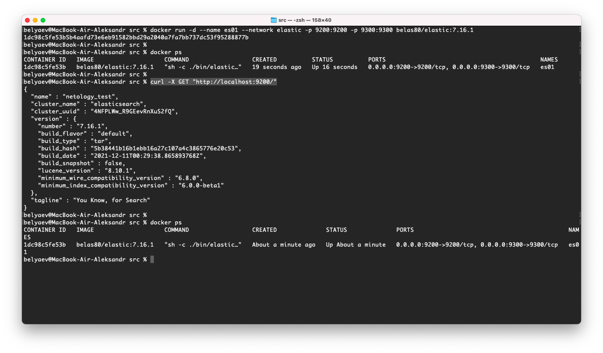

# 6.5. Elasticsearch  

## Задача 1  

   Собираем докер образ с Elasticsearch на базе centos:7.  
   Подготовим конфиг для эластика `elasticsearch.yml`, будем копировать его при создании образа:  
   ```yaml
   node.name: netology_test
   path.data: /var/lib/elasticsearch/data
   path.logs: /var/lib/elasticsearch/logs
   network.host: 0.0.0.0
   discovery.type: single-node
   ```
   Dockerfile-манифест для elasticsearch:  
   ```bash
   FROM centos:7
   
   ENV ES_HOME=/elasticsearch \
       ES_PATH_DATA_LOGS=/var/lib/elasticsearch \
       ES_VERSION=7.16.1 \
       ES_USER=elastic 
   
   RUN yum -y install wget && \
       wget https://artifacts.elastic.co/downloads/elasticsearch/elasticsearch-${ES_VERSION}-linux-x86_64.tar.gz && \
       wget https://artifacts.elastic.co/downloads/elasticsearch/elasticsearch-${ES_VERSION}-linux-x86_64.tar.gz.sha512 && \
       sha512sum -c elasticsearch-${ES_VERSION}-linux-x86_64.tar.gz.sha512 && \
       tar -xzf elasticsearch-${ES_VERSION}-linux-x86_64.tar.gz && \
       rm -f elasticsearch-${ES_VERSION}-linux-x86_64.tar.gz* && \
       mv /elasticsearch-${ES_VERSION} ${ES_HOME} && \
       mkdir -p ${ES_PATH_DATA_LOGS}/{data,logs} && \
       adduser ${ES_USER} && \
       chown -R ${ES_USER}:${ES_USER} ${ES_HOME} ${ES_PATH_DATA_LOGS} && \
       yum erase -y wget && \
       yum clean all
   
   COPY --chown=${ES_USER}:${ES_USER} elasticsearch.yml ${ES_HOME}/config
   
   WORKDIR ${ES_HOME}
   
   EXPOSE 9200
   EXPOSE 9300
   
   USER ${ES_USER}
   
   CMD [ "sh", "-c", "./bin/elasticsearch" ]
   ```
   Запускаем контейнер из созданного образа командой:  
   ```bash
   docker run -d --name es01 --network elastic -p 9200:9200 -p 9300:9300 belas80/elastic:7.16.1
   ```
   И сделаем запрос `curl -X GET "http://localhost:9200/"`  
   Результаты:  
   
   