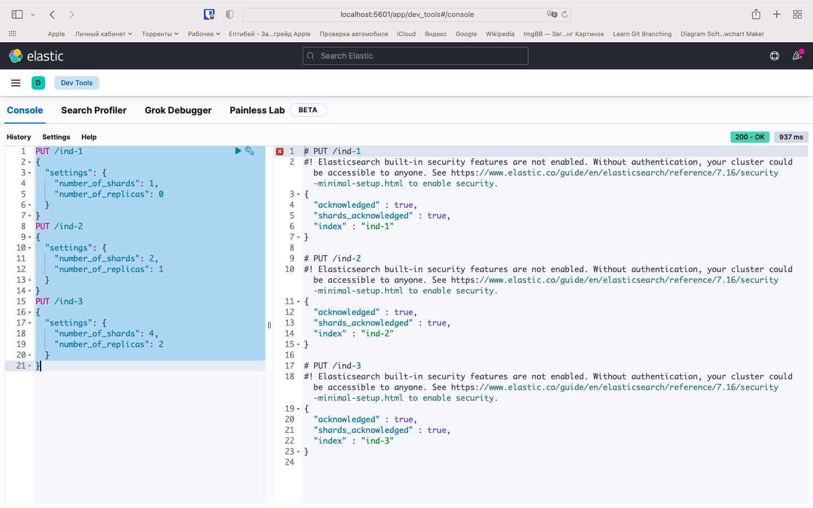

# 6.5. Elasticsearch  

## Задача 1  

   Собираем докер образ с Elasticsearch на базе centos:7.  
   Подготовим конфиг для эластика `elasticsearch.yml`, будем копировать его при создании образа:  
   ```yaml
   node.name: netology_test
   path.data: /var/lib/elasticsearch/data
   path.logs: /var/lib/elasticsearch/logs
   network.host: 0.0.0.0
   discovery.type: single-node
   ```
   Dockerfile-манифест для elasticsearch:  
   ```bash
   FROM centos:7
   
   ENV ES_HOME=/elasticsearch \
       ES_PATH_DATA_LOGS=/var/lib/elasticsearch \
       ES_VERSION=7.16.1 \
       ES_USER=elastic 
   
   RUN yum -y install wget && \
       wget https://artifacts.elastic.co/downloads/elasticsearch/elasticsearch-${ES_VERSION}-linux-x86_64.tar.gz && \
       wget https://artifacts.elastic.co/downloads/elasticsearch/elasticsearch-${ES_VERSION}-linux-x86_64.tar.gz.sha512 && \
       sha512sum -c elasticsearch-${ES_VERSION}-linux-x86_64.tar.gz.sha512 && \
       tar -xzf elasticsearch-${ES_VERSION}-linux-x86_64.tar.gz && \
       rm -f elasticsearch-${ES_VERSION}-linux-x86_64.tar.gz* && \
       mv /elasticsearch-${ES_VERSION} ${ES_HOME} && \
       mkdir -p ${ES_PATH_DATA_LOGS}/{data,logs} && \
       adduser ${ES_USER} && \
       chown -R ${ES_USER}:${ES_USER} ${ES_HOME} ${ES_PATH_DATA_LOGS} && \
       yum erase -y wget && \
       yum clean all
   
   COPY --chown=${ES_USER}:${ES_USER} elasticsearch.yml ${ES_HOME}/config
   
   WORKDIR ${ES_HOME}
   
   EXPOSE 9200
   EXPOSE 9300
   
   USER ${ES_USER}
   
   CMD [ "sh", "-c", "./bin/elasticsearch" ]
   ```
   [Ссылка на образ в репозитории dockerhub](https://hub.docker.com/r/belas80/elastic/tags)  
   Запускаем контейнер из созданного образа командой:  
   ```bash
   docker run -d --name es01 --network elastic -p 9200:9200 -p 9300:9300 belas80/elastic:7.16.1
   ```
   И сделаем запрос `curl -X GET "http://localhost:9200/"`  
   Результаты:  
     
   
## Задача 2  

   Можно использовать следующий шаблон создания индексов через `curl` в терминале:  
   ```bash
   curl -X PUT "localhost:9200/ind-1?pretty" -H 'Content-Type: application/json' -d'
   {
     "settings": {
       "number_of_shards": 1,
       "number_of_replicas": 0
     }
   }
   '
   ```
   Но для удобства работы с индексами поднимем контейнер с kibana в той же сети:  
   ```bash
   docker run -d --name kibana --network elastic -p 5601:5601 -e "ELASTICSEARCH_HOSTS=http://es01:9200" kibana:7.16.1
   ```
   Добавим в elasticsearch 3 индекса:  
     
   Список индексов и их состояний:  
   ```bash
   belyaev@MacBook-Air-Aleksandr src % curl -X GET "http://localhost:9200/_cat/indices/ind-*?v=true&s=index" 
   health status index uuid                   pri rep docs.count docs.deleted store.size pri.store.size
   green  open   ind-1 FWfo56iHTxCx57a4aYllyQ   1   0          0            0       226b           226b
   yellow open   ind-2 h3OjNVXMR8-HeGv5xGtn1A   2   1          0            0       452b           452b
   yellow open   ind-3 AjBx-Yz4T-iVIVOc_BDVoA   4   2          0            0       904b           904b   
   ```
   Список шардов:  
   ```bash
   belyaev@MacBook-Air-Aleksandr src % curl -X GET "http://localhost:9200/_cat/shards/ind-*?v=true&s=index" 
   index shard prirep state      docs store ip         node
   ind-1 0     p      STARTED       0  226b 172.18.0.2 netology_test
   ind-2 1     p      STARTED       0  226b 172.18.0.2 netology_test
   ind-2 1     r      UNASSIGNED                       
   ind-2 0     p      STARTED       0  226b 172.18.0.2 netology_test
   ind-2 0     r      UNASSIGNED                       
   ind-3 1     p      STARTED       0  226b 172.18.0.2 netology_test
   ind-3 1     r      UNASSIGNED                       
   ind-3 1     r      UNASSIGNED                       
   ind-3 2     p      STARTED       0  226b 172.18.0.2 netology_test
   ind-3 2     r      UNASSIGNED                       
   ind-3 2     r      UNASSIGNED                       
   ind-3 3     p      STARTED       0  226b 172.18.0.2 netology_test
   ind-3 3     r      UNASSIGNED                       
   ind-3 3     r      UNASSIGNED                       
   ind-3 0     p      STARTED       0  226b 172.18.0.2 netology_test
   ind-3 0     r      UNASSIGNED                       
   ind-3 0     r      UNASSIGNED                  
   ```
   Состояние кластера:  
   ```bash
   belyaev@MacBook-Air-Aleksandr src % curl -X GET "http://localhost:9200/_cat/health/?v=true"             
   epoch      timestamp cluster       status node.total node.data shards pri relo init unassign pending_tasks max_task_wait_time active_shards_percent
   1639931788 16:36:28  elasticsearch yellow          1         1     15  15    0    0       10             0                  -                 60.0%
   ```
   Часть индексов и кластер находится в состоянии yellow, потому что шарды-реплики в состоянии `UNASSIGNED`, так как у 
   нас всего одна нода.  
   Удалим все созданные нами индексы:  
   ```bash
   belyaev@MacBook-Air-Aleksandr src % curl -X DELETE "http://localhost:9200/ind-*"              
   {"acknowledged":true}
   belyaev@MacBook-Air-Aleksandr src % curl -X GET "http://localhost:9200/_cat/indices?v=true&s=index" 
   health status index                           uuid                   pri rep docs.count docs.deleted store.size pri.store.size
   green  open   .apm-agent-configuration        o0xye-JjQ6yEHHm1avA-Bw   1   0          0            0       226b           226b
   green  open   .apm-custom-link                GYUMyEhvSOir970En-XStQ   1   0          0            0       226b           226b
   green  open   .geoip_databases                wgBn05jERIi_mK3LVd4wUQ   1   0         42            0     41.2mb         41.2mb
   green  open   .kibana_7.16.1_001              qRQfp4aTR-KVYFrAiZ88Mw   1   0         40           61      2.3mb          2.3mb
   green  open   .kibana_task_manager_7.16.1_001 n9rtFCt6T2aKKlIjxHT_cQ   1   0         17         2343    350.8kb        350.8kb
   belyaev@MacBook-Air-Aleksandr src % 
   ```

## Задача 3  

   Бэкап и восстановление.  
   Создадим директорию для снапшотов в контейнере `elasticsearch`, для этого зайдем в него  
   ```bash
   docker exec -it es01 bash
   ```
   Созданим там директорию и добавим следующую строчку в `elasticsearch.yml`  
   ```bash
   path.repo: /elasticsearch/snapshots
   ```
   И перезапустим контейнер  
   ```bash
   docker restart es01
   ```
   Зарегистрируем репозиторий  
   ```bash
   belyaev@MacBook-Air-Aleksandr src % curl -X PUT "localhost:9200/_snapshot/netology_backup?pretty" -H 'Content-Type: application/json' -d'
   {
     "type": "fs",
     "settings": {
       "location": "netology_backup",
       "compress": true
     }
   }
   '
   {
     "acknowledged" : true
   }   
   ```
   Создадим индекс test с 0 реплик и 1 шардом и получим список индексов  
   ```bash
   belyaev@MacBook-Air-Aleksandr src % curl -X GET "http://localhost:9200/_cat/indices?v=true&s=index"                                      
   health status index                           uuid                   pri rep docs.count docs.deleted store.size pri.store.size
   green  open   .apm-agent-configuration        o0xye-JjQ6yEHHm1avA-Bw   1   0          0            0       226b           226b
   green  open   .apm-custom-link                GYUMyEhvSOir970En-XStQ   1   0          0            0       226b           226b
   green  open   .geoip_databases                wgBn05jERIi_mK3LVd4wUQ   1   0         42            0     41.2mb         41.2mb
   green  open   .kibana_7.16.1_001              qRQfp4aTR-KVYFrAiZ88Mw   1   0         43            5      2.4mb          2.4mb
   green  open   .kibana_task_manager_7.16.1_001 n9rtFCt6T2aKKlIjxHT_cQ   1   0         17          561    317.2kb        317.2kb
   green  open   test                            TsROE3CnTICmKZnWeXsuLA   1   0          0            0       226b           226b
   belyaev@MacBook-Air-Aleksandr src %    
   ```
   Создадим снапшот кластера  
   ```bash
   belyaev@MacBook-Air-Aleksandr src % curl -X PUT "localhost:9200/_snapshot/netology_backup/%3Cmy_elastic_%7Bnow%2Fd%7D%3E?pretty"
   {
     "accepted" : true
   }   
   
   belyaev@MacBook-Air-Aleksandr src % curl -X GET "http://localhost:9200/_cat/snapshots?v=true"
   id                    repository       status start_epoch start_time end_epoch  end_time duration indices successful_shards failed_shards total_shards
   my_elastic_2021.12.19 netology_backup SUCCESS 1639937716  18:15:16   1639937724 18:15:24     7.7s       9                 9             0            9
   ```
   Список файлов в директории снапшотов  
   ```bash
   [elastic@e4d2cb2002d7 elasticsearch]$ ls -l snapshots/netology_backup/
   total 32
   -rw-r--r--  1 elastic elastic  2758 Dec 19 18:15 index-0
   -rw-r--r--  1 elastic elastic     8 Dec 19 18:15 index.latest
   drwxr-xr-x 11 elastic elastic  4096 Dec 19 18:15 indices
   -rw-r--r--  1 elastic elastic 13520 Dec 19 18:15 meta-scHCHWjDTniI2QG0lblhmw.dat
   -rw-r--r--  1 elastic elastic   599 Dec 19 18:15 snap-scHCHWjDTniI2QG0lblhmw.dat
   [elastic@e4d2cb2002d7 elasticsearch]$    
   ```
   Удалим индекс test, и создадим индекс test-2. Список индексов:  
   ```bash
   belyaev@MacBook-Air-Aleksandr src % curl -X GET "http://localhost:9200/_cat/indices?v=true&s=index"
   health status index                           uuid                   pri rep docs.count docs.deleted store.size pri.store.size
   green  open   .apm-agent-configuration        o0xye-JjQ6yEHHm1avA-Bw   1   0          0            0       226b           226b
   green  open   .apm-custom-link                GYUMyEhvSOir970En-XStQ   1   0          0            0       226b           226b
   green  open   .geoip_databases                wgBn05jERIi_mK3LVd4wUQ   1   0         42            0     41.2mb         41.2mb
   green  open   .kibana_7.16.1_001              qRQfp4aTR-KVYFrAiZ88Mw   1   0         49           13      2.4mb          2.4mb
   green  open   .kibana_task_manager_7.16.1_001 n9rtFCt6T2aKKlIjxHT_cQ   1   0         17          584    417.4kb        417.4kb
   green  open   test-2                          6cHeqxCPT_ikb2FnUCJW9Q   1   0          0            0       226b           226b
   belyaev@MacBook-Air-Aleksandr src % 
   ```
   Восстановим удаленный индекс `elasticsearch` из `snapshot`, созданного ранее:  
   ```bash
   belyaev@MacBook-Air-Aleksandr src % curl -X POST "localhost:9200/_snapshot/netology_backup/my_elastic_2021.12.19/_restore?pretty" -H 'Content-Type: application/json' -d'
   {
     "indices": "test"
   }
   '
   
   {
     "accepted" : true
   }   
   ```
   Итоговый список индексов:  
   ```bash
   belyaev@MacBook-Air-Aleksandr src % curl -X GET "http://localhost:9200/_cat/indices?v=true&s=index"
   health status index                           uuid                   pri rep docs.count docs.deleted store.size pri.store.size
   green  open   .apm-agent-configuration        o0xye-JjQ6yEHHm1avA-Bw   1   0          0            0       226b           226b
   green  open   .apm-custom-link                GYUMyEhvSOir970En-XStQ   1   0          0            0       226b           226b
   green  open   .geoip_databases                wgBn05jERIi_mK3LVd4wUQ   1   0         42            0     41.2mb         41.2mb
   green  open   .kibana_7.16.1_001              qRQfp4aTR-KVYFrAiZ88Mw   1   0         58           13      2.4mb          2.4mb
   green  open   .kibana_task_manager_7.16.1_001 n9rtFCt6T2aKKlIjxHT_cQ   1   0         17         2351      775kb          775kb
   green  open   .tasks                          k0fqhsRTTdyXRQAV_pzwxQ   1   0          4            0     21.4kb         21.4kb
   green  open   test                            aaxN2Z5MRQiG_jK43-Bpng   1   0          0            0       226b           226b
   green  open   test-2                          6cHeqxCPT_ikb2FnUCJW9Q   1   0          0            0       226b           226b
   ```
