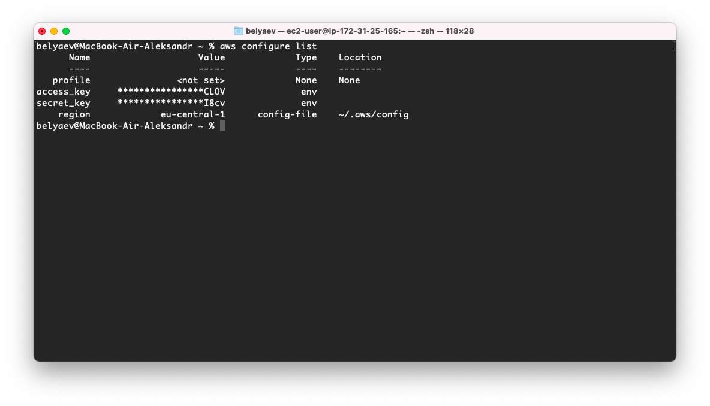
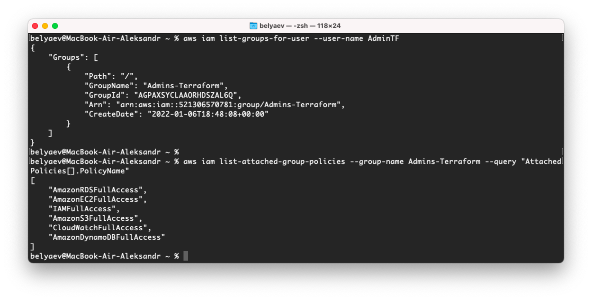
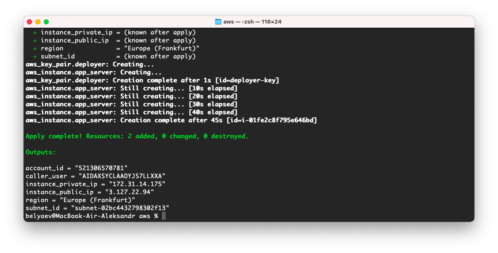
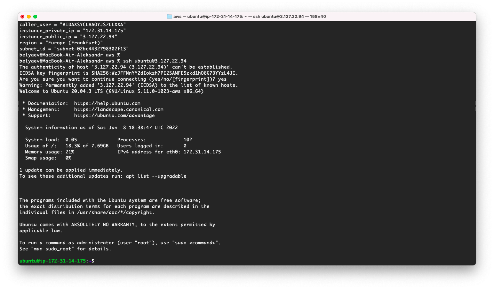
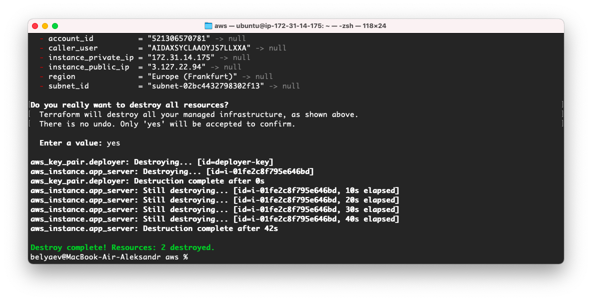

# 7.2. Облачные провайдеры и синтаксис Terraform.  

## Задача 1  

   Регистрация в aws и знакомство с основами  
     
   Создал группу `Admins-Terraform` с требуемыми правами, создал и довавил в эту группу пользователя `AdminTF`  
     
   Далее все действия выполнял от этого пользователя.  
   
## Задача 2  

   Создание aws ec2 через терраформ  
     
   Вход по ssh на созданный инстанс ec2  
     
   Удаление созданных ресурсов через терраформ  
     
   Свой образ ami можно создать с помощью Packer.  
   [Исходники конфигурации терраформа AWS.](https://github.com/belas80/devops-netology/tree/main/homeworks/07-terraform-02-syntax/src/terraform/aws)
   [Исходники конфигурации терраформа Yandex Cloud.](https://github.com/belas80/devops-netology/tree/main/homeworks/07-terraform-02-syntax/src/terraform/yc)