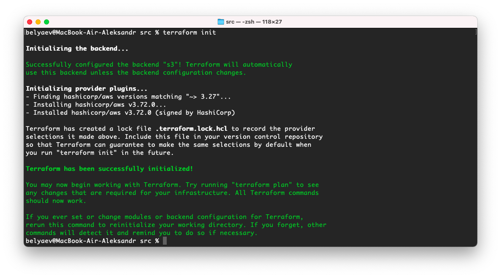
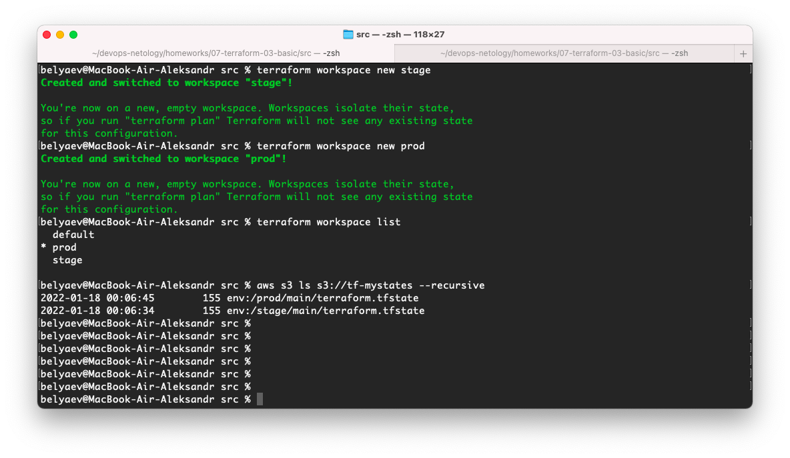

# 7.3. Основы и принцип работы Терраформ  

## Задача 1. Создадим бэкэнд в S3  

   Cоздание S3 бакета:  
   ```bash
   belyaev@MacBook-Air-Aleksandr ~ % aws s3 mb s3://tf-mystates
   make_bucket: tf-mystates
   ```
   Для регистрации бэкэнда создадим в проекте файл `backend.tf` следующего содержимого:  
   ```terraform
   terraform {
     backend "s3" {
       bucket = "tf-mystates"
       key    = "main/terraform.tfstate"
       region = "eu-central-1"
     }
   }
   ```

## Задача 2. Инициализируем проект и создаем воркспейсы.  

   1. Выполняем `terraform init`:  
        
   2. Создаем два воркспейса `stage` и `prod`:  
        
   3. Добавим зависимость типа инстанса от вокспейса, что бы в разных ворскспейсах использовались разные `instance_type`.
      Для этого определим переменную в файле `variables.tf`:  
      ```terraform
      variable "web_instance_type_map" {
        type = map(string)
        default = {
          stage = "t2.micro"
          prod  = "t3.large"
        }
      }
      ```
      А в `main.tf` в блоке ресурса тип инстанса укажем как `instance_type = var.web_instance_type_map[terraform.workspace]`  
   4. Добавим `count`. Для `stage` должен создаться один экземпляр ec2, а для `prod` два.  
      В `variable.tf` определим соответствующую переменную:  
      ```terraform
      variable "web_instance_count_map" {
        type = map(number)
        default = {
          stage = 1
          prod  = 2
        }
      }
      ```
      В блоке ресурса укажем `count = var.web_instance_count_map[terraform.workspace]`  
      Так как сейчас у нас несколько инстансов, не забудем про outputs, добавив [count.index] в `value`. Например для
      `public_ip`  
      ```terraform
      output "instance_public_ip" {
        description = "Public IP address of the EC2 instance"
        value       = aws_instance.app_server[*].public_ip
      }
      ```  
   5. Создадим рядом еще один `aws_instance`, но теперь определите их количество при помощи `for_each`, а не `count`.  
      Переменная  
      ```terraform
      locals {
        instances = {
          "Server1" = data.aws_ami.ubuntu.id
          "Server2" = data.aws_ami.ubuntu.id
        }
      }
      ```
      Ресурс, и сразу добавим ему жизненный цикл `create_before_destroy`  
      ```terraform
      resource "aws_instance" "app_server2" {
        for_each      = local.instances
        ami           = each.value
        instance_type = var.web_instance_type_map[terraform.workspace]
      
        key_name = "deployer-key"
          
        tags = {
          Name = "HelloWorld"
        }
      
        lifecycle {
          create_before_destroy = true
        }
      }
      ```

   Результаты  
   * Вывод команды `terraform workspace list`  
     ```bash
     belyaev@MacBook-Air-Aleksandr src % terraform workspace list
       default
     * prod
       stage
     ```
   * dfdf
     ```bash
     belyaev@MacBook-Air-Aleksandr src % terraform plan
     
     Terraform used the selected providers to generate the following execution plan. Resource actions are indicated with
     the following symbols:
       + create
     
     Terraform will perform the following actions:
     
       # aws_instance.app_server[0] will be created
       + resource "aws_instance" "app_server" {
           + ami                                  = "ami-0d267e97f16681cd8"
           + arn                                  = (known after apply)
           + associate_public_ip_address          = (known after apply)
           + availability_zone                    = (known after apply)
           + cpu_core_count                       = (known after apply)
           + cpu_threads_per_core                 = (known after apply)
           + disable_api_termination              = (known after apply)
           + ebs_optimized                        = (known after apply)
           + get_password_data                    = false
           + host_id                              = (known after apply)
           + id                                   = (known after apply)
           + instance_initiated_shutdown_behavior = (known after apply)
           + instance_state                       = (known after apply)
           + instance_type                        = "t3.large"
           + ipv6_address_count                   = (known after apply)
           + ipv6_addresses                       = (known after apply)
           + key_name                             = "deployer-key"
           + monitoring                           = (known after apply)
           + outpost_arn                          = (known after apply)
           + password_data                        = (known after apply)
           + placement_group                      = (known after apply)
           + placement_partition_number           = (known after apply)
           + primary_network_interface_id         = (known after apply)
           + private_dns                          = (known after apply)
           + private_ip                           = (known after apply)
           + public_dns                           = (known after apply)
           + public_ip                            = (known after apply)
           + secondary_private_ips                = (known after apply)
           + security_groups                      = (known after apply)
           + source_dest_check                    = true
           + subnet_id                            = (known after apply)
           + tags                                 = {
               + "Name" = "HelloWorld"
             }
           + tags_all                             = {
               + "Name" = "HelloWorld"
             }
           + tenancy                              = (known after apply)
           + user_data                            = (known after apply)
           + user_data_base64                     = (known after apply)
           + vpc_security_group_ids               = (known after apply)
     
           + capacity_reservation_specification {
               + capacity_reservation_preference = (known after apply)
     
               + capacity_reservation_target {
                   + capacity_reservation_id = (known after apply)
                 }
             }
     
           + ebs_block_device {
               + delete_on_termination = (known after apply)
               + device_name           = (known after apply)
               + encrypted             = (known after apply)
               + iops                  = (known after apply)
               + kms_key_id            = (known after apply)
               + snapshot_id           = (known after apply)
               + tags                  = (known after apply)
               + throughput            = (known after apply)
               + volume_id             = (known after apply)
               + volume_size           = (known after apply)
               + volume_type           = (known after apply)
             }
     
           + enclave_options {
               + enabled = (known after apply)
             }
     
           + ephemeral_block_device {
               + device_name  = (known after apply)
               + no_device    = (known after apply)
               + virtual_name = (known after apply)
             }
     
           + metadata_options {
               + http_endpoint               = (known after apply)
               + http_put_response_hop_limit = (known after apply)
               + http_tokens                 = (known after apply)
               + instance_metadata_tags      = (known after apply)
             }
     
           + network_interface {
               + delete_on_termination = (known after apply)
               + device_index          = (known after apply)
               + network_interface_id  = (known after apply)
             }
     
           + root_block_device {
               + delete_on_termination = (known after apply)
               + device_name           = (known after apply)
               + encrypted             = (known after apply)
               + iops                  = (known after apply)
               + kms_key_id            = (known after apply)
               + tags                  = (known after apply)
               + throughput            = (known after apply)
               + volume_id             = (known after apply)
               + volume_size           = (known after apply)
               + volume_type           = (known after apply)
             }
         }
     
       # aws_instance.app_server[1] will be created
       + resource "aws_instance" "app_server" {
           + ami                                  = "ami-0d267e97f16681cd8"
           + arn                                  = (known after apply)
           + associate_public_ip_address          = (known after apply)
           + availability_zone                    = (known after apply)
           + cpu_core_count                       = (known after apply)
           + cpu_threads_per_core                 = (known after apply)
           + disable_api_termination              = (known after apply)
           + ebs_optimized                        = (known after apply)
           + get_password_data                    = false
           + host_id                              = (known after apply)
           + id                                   = (known after apply)
           + instance_initiated_shutdown_behavior = (known after apply)
           + instance_state                       = (known after apply)
           + instance_type                        = "t3.large"
           + ipv6_address_count                   = (known after apply)
           + ipv6_addresses                       = (known after apply)
           + key_name                             = "deployer-key"
           + monitoring                           = (known after apply)
           + outpost_arn                          = (known after apply)
           + password_data                        = (known after apply)
           + placement_group                      = (known after apply)
           + placement_partition_number           = (known after apply)
           + primary_network_interface_id         = (known after apply)
           + private_dns                          = (known after apply)
           + private_ip                           = (known after apply)
           + public_dns                           = (known after apply)
           + public_ip                            = (known after apply)
           + secondary_private_ips                = (known after apply)
           + security_groups                      = (known after apply)
           + source_dest_check                    = true
           + subnet_id                            = (known after apply)
           + tags                                 = {
               + "Name" = "HelloWorld"
             }
           + tags_all                             = {
               + "Name" = "HelloWorld"
             }
           + tenancy                              = (known after apply)
           + user_data                            = (known after apply)
           + user_data_base64                     = (known after apply)
           + vpc_security_group_ids               = (known after apply)
     
           + capacity_reservation_specification {
               + capacity_reservation_preference = (known after apply)
     
               + capacity_reservation_target {
                   + capacity_reservation_id = (known after apply)
                 }
             }
     
           + ebs_block_device {
               + delete_on_termination = (known after apply)
               + device_name           = (known after apply)
               + encrypted             = (known after apply)
               + iops                  = (known after apply)
               + kms_key_id            = (known after apply)
               + snapshot_id           = (known after apply)
               + tags                  = (known after apply)
               + throughput            = (known after apply)
               + volume_id             = (known after apply)
               + volume_size           = (known after apply)
               + volume_type           = (known after apply)
             }
     
           + enclave_options {
               + enabled = (known after apply)
             }
     
           + ephemeral_block_device {
               + device_name  = (known after apply)
               + no_device    = (known after apply)
               + virtual_name = (known after apply)
             }
     
           + metadata_options {
               + http_endpoint               = (known after apply)
               + http_put_response_hop_limit = (known after apply)
               + http_tokens                 = (known after apply)
               + instance_metadata_tags      = (known after apply)
             }
     
           + network_interface {
               + delete_on_termination = (known after apply)
               + device_index          = (known after apply)
               + network_interface_id  = (known after apply)
             }
     
           + root_block_device {
               + delete_on_termination = (known after apply)
               + device_name           = (known after apply)
               + encrypted             = (known after apply)
               + iops                  = (known after apply)
               + kms_key_id            = (known after apply)
               + tags                  = (known after apply)
               + throughput            = (known after apply)
               + volume_id             = (known after apply)
               + volume_size           = (known after apply)
               + volume_type           = (known after apply)
             }
         }
     
       # aws_instance.app_server2["Server1"] will be created
       + resource "aws_instance" "app_server2" {
           + ami                                  = "ami-0d267e97f16681cd8"
           + arn                                  = (known after apply)
           + associate_public_ip_address          = (known after apply)
           + availability_zone                    = (known after apply)
           + cpu_core_count                       = (known after apply)
           + cpu_threads_per_core                 = (known after apply)
           + disable_api_termination              = (known after apply)
           + ebs_optimized                        = (known after apply)
           + get_password_data                    = false
           + host_id                              = (known after apply)
           + id                                   = (known after apply)
           + instance_initiated_shutdown_behavior = (known after apply)
           + instance_state                       = (known after apply)
           + instance_type                        = "t3.large"
           + ipv6_address_count                   = (known after apply)
           + ipv6_addresses                       = (known after apply)
           + key_name                             = "deployer-key"
           + monitoring                           = (known after apply)
           + outpost_arn                          = (known after apply)
           + password_data                        = (known after apply)
           + placement_group                      = (known after apply)
           + placement_partition_number           = (known after apply)
           + primary_network_interface_id         = (known after apply)
           + private_dns                          = (known after apply)
           + private_ip                           = (known after apply)
           + public_dns                           = (known after apply)
           + public_ip                            = (known after apply)
           + secondary_private_ips                = (known after apply)
           + security_groups                      = (known after apply)
           + source_dest_check                    = true
           + subnet_id                            = (known after apply)
           + tags                                 = {
               + "Name" = "HelloWorld"
             }
           + tags_all                             = {
               + "Name" = "HelloWorld"
             }
           + tenancy                              = (known after apply)
           + user_data                            = (known after apply)
           + user_data_base64                     = (known after apply)
           + vpc_security_group_ids               = (known after apply)
     
           + capacity_reservation_specification {
               + capacity_reservation_preference = (known after apply)
     
               + capacity_reservation_target {
                   + capacity_reservation_id = (known after apply)
                 }
             }
     
           + ebs_block_device {
               + delete_on_termination = (known after apply)
               + device_name           = (known after apply)
               + encrypted             = (known after apply)
               + iops                  = (known after apply)
               + kms_key_id            = (known after apply)
               + snapshot_id           = (known after apply)
               + tags                  = (known after apply)
               + throughput            = (known after apply)
               + volume_id             = (known after apply)
               + volume_size           = (known after apply)
               + volume_type           = (known after apply)
             }
     
           + enclave_options {
               + enabled = (known after apply)
             }
     
           + ephemeral_block_device {
               + device_name  = (known after apply)
               + no_device    = (known after apply)
               + virtual_name = (known after apply)
             }
     
           + metadata_options {
               + http_endpoint               = (known after apply)
               + http_put_response_hop_limit = (known after apply)
               + http_tokens                 = (known after apply)
               + instance_metadata_tags      = (known after apply)
             }
     
           + network_interface {
               + delete_on_termination = (known after apply)
               + device_index          = (known after apply)
               + network_interface_id  = (known after apply)
             }
     
           + root_block_device {
               + delete_on_termination = (known after apply)
               + device_name           = (known after apply)
               + encrypted             = (known after apply)
               + iops                  = (known after apply)
               + kms_key_id            = (known after apply)
               + tags                  = (known after apply)
               + throughput            = (known after apply)
               + volume_id             = (known after apply)
               + volume_size           = (known after apply)
               + volume_type           = (known after apply)
             }
         }
     
       # aws_instance.app_server2["Server2"] will be created
       + resource "aws_instance" "app_server2" {
           + ami                                  = "ami-0d267e97f16681cd8"
           + arn                                  = (known after apply)
           + associate_public_ip_address          = (known after apply)
           + availability_zone                    = (known after apply)
           + cpu_core_count                       = (known after apply)
           + cpu_threads_per_core                 = (known after apply)
           + disable_api_termination              = (known after apply)
           + ebs_optimized                        = (known after apply)
           + get_password_data                    = false
           + host_id                              = (known after apply)
           + id                                   = (known after apply)
           + instance_initiated_shutdown_behavior = (known after apply)
           + instance_state                       = (known after apply)
           + instance_type                        = "t3.large"
           + ipv6_address_count                   = (known after apply)
           + ipv6_addresses                       = (known after apply)
           + key_name                             = "deployer-key"
           + monitoring                           = (known after apply)
           + outpost_arn                          = (known after apply)
           + password_data                        = (known after apply)
           + placement_group                      = (known after apply)
           + placement_partition_number           = (known after apply)
           + primary_network_interface_id         = (known after apply)
           + private_dns                          = (known after apply)
           + private_ip                           = (known after apply)
           + public_dns                           = (known after apply)
           + public_ip                            = (known after apply)
           + secondary_private_ips                = (known after apply)
           + security_groups                      = (known after apply)
           + source_dest_check                    = true
           + subnet_id                            = (known after apply)
           + tags                                 = {
               + "Name" = "HelloWorld"
             }
           + tags_all                             = {
               + "Name" = "HelloWorld"
             }
           + tenancy                              = (known after apply)
           + user_data                            = (known after apply)
           + user_data_base64                     = (known after apply)
           + vpc_security_group_ids               = (known after apply)
     
           + capacity_reservation_specification {
               + capacity_reservation_preference = (known after apply)
     
               + capacity_reservation_target {
                   + capacity_reservation_id = (known after apply)
                 }
             }
     
           + ebs_block_device {
               + delete_on_termination = (known after apply)
               + device_name           = (known after apply)
               + encrypted             = (known after apply)
               + iops                  = (known after apply)
               + kms_key_id            = (known after apply)
               + snapshot_id           = (known after apply)
               + tags                  = (known after apply)
               + throughput            = (known after apply)
               + volume_id             = (known after apply)
               + volume_size           = (known after apply)
               + volume_type           = (known after apply)
             }
     
           + enclave_options {
               + enabled = (known after apply)
             }
     
           + ephemeral_block_device {
               + device_name  = (known after apply)
               + no_device    = (known after apply)
               + virtual_name = (known after apply)
             }
     
           + metadata_options {
               + http_endpoint               = (known after apply)
               + http_put_response_hop_limit = (known after apply)
               + http_tokens                 = (known after apply)
               + instance_metadata_tags      = (known after apply)
             }
     
           + network_interface {
               + delete_on_termination = (known after apply)
               + device_index          = (known after apply)
               + network_interface_id  = (known after apply)
             }
     
           + root_block_device {
               + delete_on_termination = (known after apply)
               + device_name           = (known after apply)
               + encrypted             = (known after apply)
               + iops                  = (known after apply)
               + kms_key_id            = (known after apply)
               + tags                  = (known after apply)
               + throughput            = (known after apply)
               + volume_id             = (known after apply)
               + volume_size           = (known after apply)
               + volume_type           = (known after apply)
             }
         }
     
       # aws_key_pair.deployer will be created
       + resource "aws_key_pair" "deployer" {
           + arn             = (known after apply)
           + fingerprint     = (known after apply)
           + id              = (known after apply)
           + key_name        = "deployer-key"
           + key_name_prefix = (known after apply)
           + key_pair_id     = (known after apply)
           + public_key      = "ssh-rsa AAAAB3NzaC1yc2EAAAADAQABAAABAQDAMprF0MsPCijfrdgdJO4j/2S92exCCzwpLPlAWwj4E032bopXIUV7eHE7TTZmHBPdjwq2hEbfAw/U2YhtnOQzSzyxUaiLRLRjx9tRT30ij2ty7AApaSXCKrbvwHwbSXvvJYTcBM10MY2IHey4HKG5yLUe/Uw4rTfXOlDXGaPYeLL1F89kiHDUgRJa8fOI0iMxxyzt5qsDmtPYw15UQB3MJ89AzkRKX8hCHXMQXtCEyOSvQlmyOLxB0IeXGs32+ckFqB53qR7tu5vU3CNkPURBAaRHLVHBeqfKMoXPnpj5IRHC0siNdbHT3+9XnedBo4nbfe+jKDRP/ttKQuA9+f2t belyaev@air-aleksandr.holding.local"
           + tags_all        = (known after apply)
         }
     
     Plan: 5 to add, 0 to change, 0 to destroy.
     
     Changes to Outputs:
       + account_id          = "521306570781"
       + caller_user         = "AIDAXSYCLAAOYJS7LLXXA"
       + instance_private_ip = [
           + (known after apply),
           + (known after apply),
         ]
       + instance_public_ip  = [
           + (known after apply),
           + (known after apply),
         ]
       + region              = "Europe (Frankfurt)"
       + subnet_id           = [
           + (known after apply),
           + (known after apply),
         ]
     
     ─────────────────────────────────────────────────────────────────────────────────────────────────────────────────────
     
     Note: You didn't use the -out option to save this plan, so Terraform can't guarantee to take exactly these actions if
     you run "terraform apply" now.     
     ```  
     