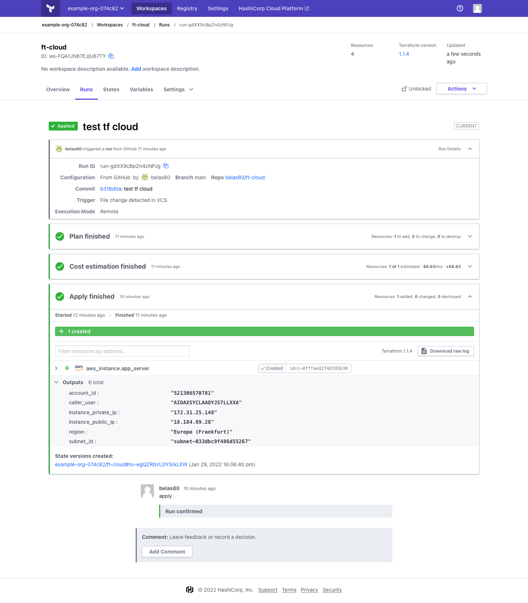
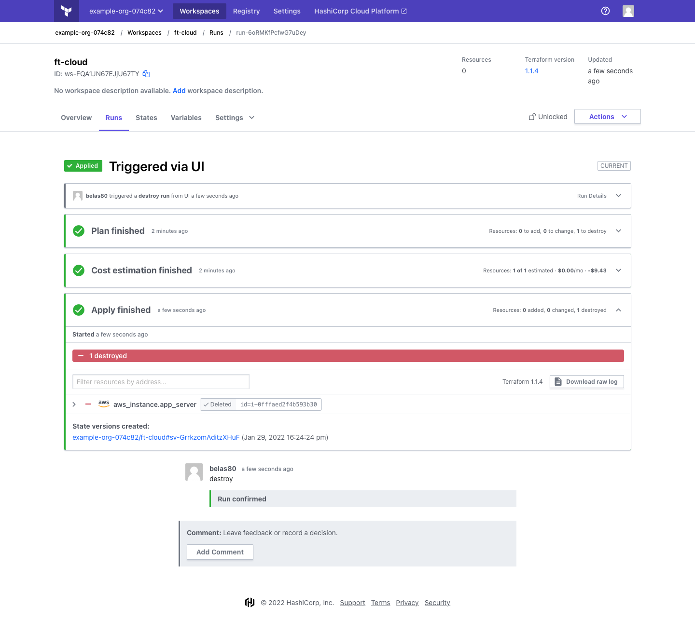
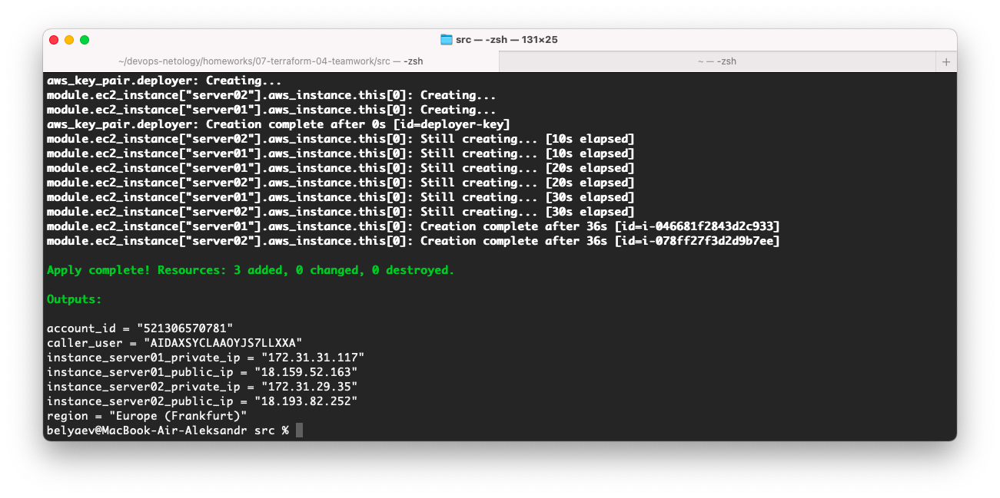

# 7.4. Средства командной работы над инфраструктурой.  

## Задача 1. Настроить terraform cloud  

   Plan & Apply:  
     
     
     
   Destroy:  
   
     
   
## Задача 2. Написать серверный конфиг для атлантиса.  

   Файл `server.yaml`:  
   ```yaml
   # Укажите, что атлантис должен работать только для репозиториев в вашем github
   repos:
     # Уазываем для репосов в моем (belas80) гите
   - id: /github.com/belas80/.*/
   
     # На стороне клиентского конфига разрешите изменять workflow
     allowed_overrides: [workflow]
     allow_custom_workflows: true
   
   # В workflow используемом по-умолчанию сделайте так, что бы во время планирования не происходил lock состояния.
   workflows:
     default:
       plan:
         steps:
         - init
         - plan:
             extra_args: ["-lock", "false"]
   ```
   Файл `atlantis.yaml`, в корне terraform проекта:  
   ```yaml
   # Надо запускать планирование и аплай для двух воркспейсов stage и prod.
   # Необходимо включить автопланирование при изменении любых файлов *.tf.
   version: 3
   projects:
   - dir: .
     workspace: stage
     autoplan:
       when_modified: ["../modules/**/*.tf", "*.tf*"]
       enabled: true
   - dir: .
     workspace: prode
     autoplan:
       when_modified: ["../modules/**/*.tf", "*.tf*"]
       enabled: true   
   ```

## Зачача 3. Знакомство с каталогом модулей.  

   В принципе готовый модуль использовать можно, но я бы предпочел написать свой. Возможно взять что то из него за основу.  
   Получившийся блок модуля  
   ```terraform
   module "ec2_instance" {
     source  = "terraform-aws-modules/ec2-instance/aws"
     version = "~> 3.0"
   
     for_each = var.my-instances
     name     = "my-instance-${each.key}"
   
     ami           = data.aws_ami.ubuntu.id
     instance_type = var.web_instance_type_map[terraform.workspace]
     key_name      = "deployer-key"
   
     tags = {
       Terraform   = "true"
       Environment = "dev"
     }
   }
   ```
   Исходники   
   Результат создания инстансов  
   