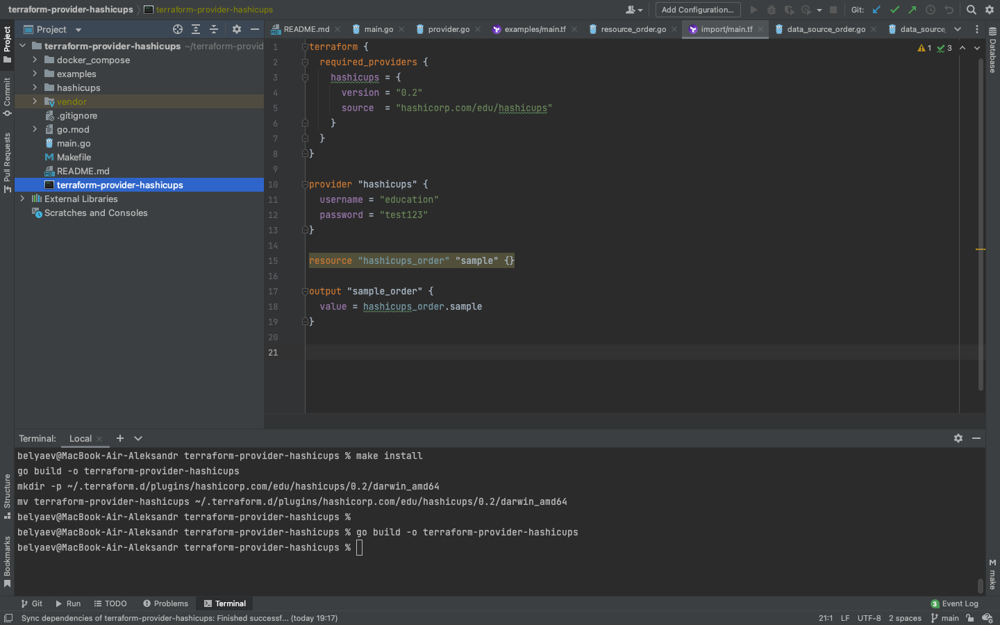

# 7.6. Написание собственных провайдеров для Terraform.  

## Задача 1.  

   Исходный код AWS провайдера [https://github.com/hashicorp/terraform-provider-aws.git](https://github.com/hashicorp/terraform-provider-aws.git).  
   1. Все доступные `resource` и `data_source` перечислены в файле `internal/provider/provider.go` 
      [здесь](https://github.com/hashicorp/terraform-provider-aws/blob/61c61be9ddad3ad5e6d8368d23ee12b0f674a566/internal/provider/provider.go#L789) 
      и [здесь](https://github.com/hashicorp/terraform-provider-aws/blob/61c61be9ddad3ad5e6d8368d23ee12b0f674a566/internal/provider/provider.go#L376).
   2. Для ресурса `aws_sqs_queue` параметр `name` конфликтует с параметром `name_prefix`. Это указано [здесь](https://github.com/hashicorp/terraform-provider-aws/blob/9a5875faab6b8732d7887438d285e43f253adb43/internal/service/sqs/queue.go#L87).
   3. Максимальная длинна имени 80 символов, это видно по регулярным выражениям в блоке `if` [здесь](https://github.com/hashicorp/terraform-provider-aws/blob/9a5875faab6b8732d7887438d285e43f253adb43/internal/service/sqs/queue.go#L424).
   4. Имя должно подчинятся вот [этому](https://github.com/hashicorp/terraform-provider-aws/blob/9a5875faab6b8732d7887438d285e43f253adb43/internal/service/sqs/queue.go#L427) регулярному выражению. Но  если указан параметр `fifo_queue` в `true`, то вот 
      [этому](https://github.com/hashicorp/terraform-provider-aws/blob/9a5875faab6b8732d7887438d285e43f253adb43/internal/service/sqs/queue.go#L425), где к имени добавляется окончание `.fifo`, но общая длина символов все равно остается 80. Само регулярное 
      выражение это большие и малые буквы алфавита, цифры от 0 до 9, подчеркивание и знак минус.  

## Задача 2.  

   Прошел шаги созадния своего провайдера для hushicups [https://learn.hashicorp.com/collections/terraform/providers](https://learn.hashicorp.com/collections/terraform/providers).  
   [Ссылка на получившийся исходный код](https://github.com/belas80/terraform-provider-hashicups)  
   Компиляция провайдера, как через `make`, так и просто `go build`  
   
   
